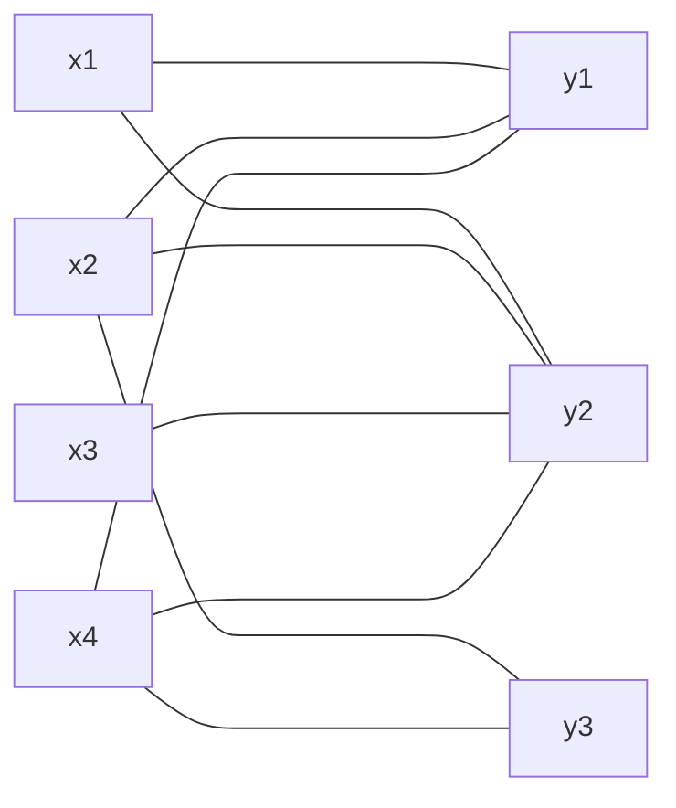
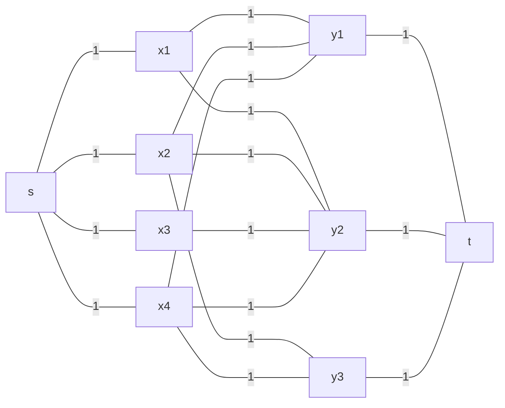

A bipartite graph is a graph whose vertex stet can be partitioned into two sets $X$ and $Y$, such that every edge joins a vertex in $X$ to a vertex in $Y$:

## Matchings
This is where we use a subset of the edges to produce a graph where each vertex appears in at most one edge.

Generally we want to produce the **largest matching**, such as pairing people with ideal tasks, so that people are has happy as possible.

We can generate such a matching by posing this as a network flow problem. We can add a source $s$ connected to all $x$ vertices and a sink $t$ connected to all $y$ vertices. We weight all edges as one:

We can then calculate a maximal matching using a maximal flow algorithm such as [Ford-Fulkerson]({{site.baseurl}}/comp202/lectures/2022/05/07/1#ford-fulkerson-method).