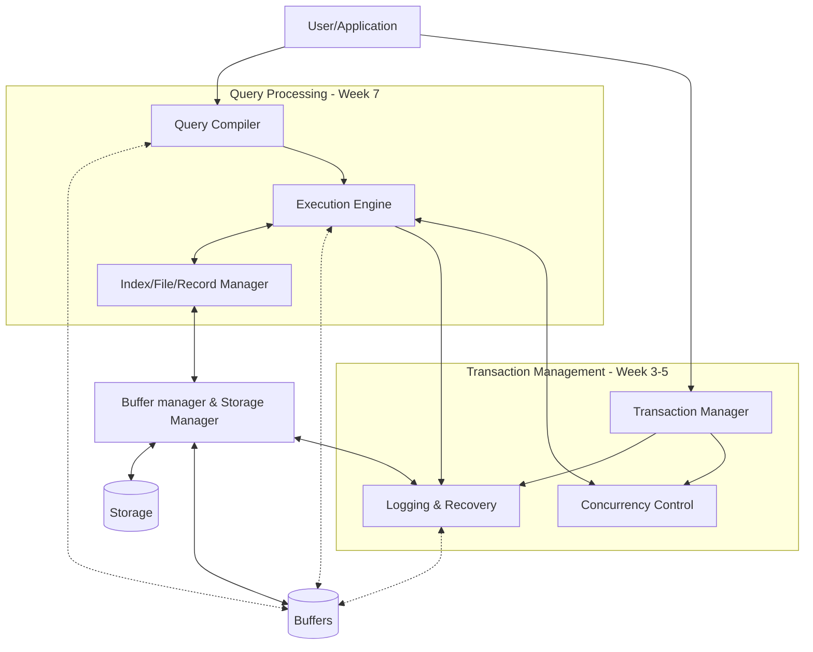

## Running Example - Supermarket
The example for the course is a fake supermarket called **CS Store**. It is initially based in Liverpool but will become a national company. 

## Relational DBMS Components
A **DBMS** is a *database management system*.

