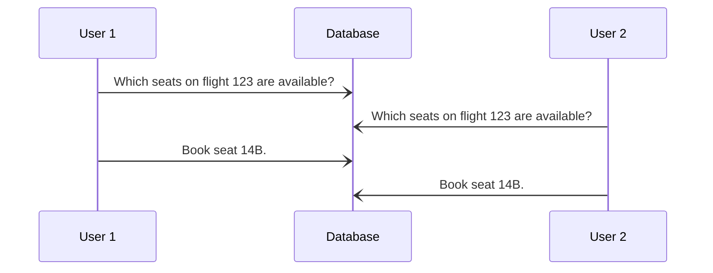

These are a sequence of SQL statements one after the other. There may be issues if transactions are running in parallel or if a single transaction fails.

## Concurrency
If multiple people are interacting with a database then you may run into bugs like the following:



This might lead to an inconsistent database.
{:.info}

If "User 1" completed their transaction all in one go then this wouldn't be a problem.

### Transactions Solution
This allows a series of statements to be grouped together and run in order:

```sql
START TRANSACTION;
SELECT	seatNo
FROM	Flights
WHERE	flightNo = 123 AND date = '2020-10-30'
	AND seatStatus = 'available';
UPDATE	Flights
SET	seatStatus = 'occupied'
WHERE	flightNo = 123 AND date = '2020-10-30'
	AND seatNo = '14B';
COMMIT;
```

`START TRANSACTION;` is often not required.
{:.info}

Before `COMMIT;` all changes are tentative.
{:.info}

By running a transaction we ensure **serialisable behaviour**:

* This is like the whole transaction is run in isolation from other transactions.

## Partial Execution
If a transaction failed half way through a transaction this could leave the database in an unacceptable state. For example if an error occurred half way through a transaction.

### Transactions Solution
To fix this SQL allows us to state that a transaction must be executed atomically (as a whole or not at all):

```sql
START TRANSACTION;
UPDATE	Accounts
SET	balance = balance + 100
WHERE	accountNo = 456;
UPDATE	Accounts
SET	balance = balance - 100
WHERE	accountNo = 123;
COMMIT;
```

## Transaction Syntax
A transaction is a sequence of SQL statement wrapped in:

```sql
START TRANSACTION;

-- SQL Statements

COMMIT; /* or ROLLBACK; */
```

`ROLLBACK;` aborts the transaction and enacts no changes.
{:.info}