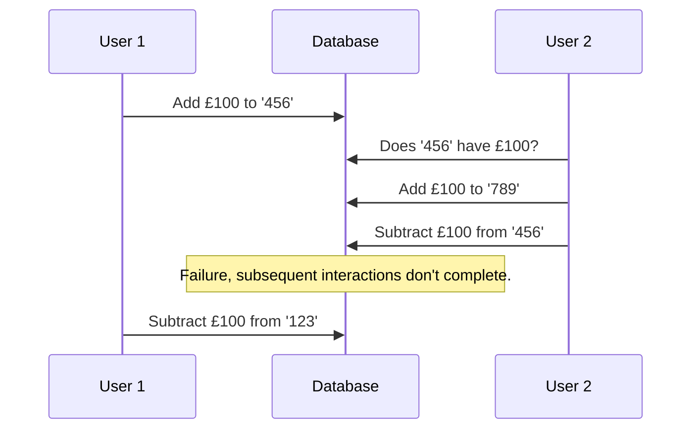

## Concurrency Example
Consider the [concurrency]({{site.baseurl}}/comp207/lectures/2021/10/19/1.html#concurrency) example that was shown before. The specific ordering of the statements made it such that a seat was double-booked.

There are a few issues with how the transactions interacted with eachother:

* The two transactions are not **isolated** from each-other.
* Additionally, the outcome in not **consistent** with the real world.

To solve this issue we could:

* Undo the second transaction when it tries to do the second operation.

## Partial Execution Example
Consider a bank transfer from one account to another. A failure, mid-transaction, could leave the database in an unacceptable state.

There is an issue with how only parts of the transaction get executed:

* A transaction should be **atomic** (indivisible).
* Maybe not **consistent** with the real world as the account is not debited properly.

To solve the issue we could:

* Undo the transaction when the computer comes back online.

## Concurrency & Partial Execution Example
Consider the following turn of events:

* User 1 has account `123`.
* User 2 has account `456`.

This leaves User 1 with £100 more than expected.
{:.error}

### Problems
There is an issue with how parts of the first transaction get executed:

* A transaction should be **atomic**.

There is an issue with how the two transactions interact:

* **Consistency** issue as user 2 had £100 before user 1 has committed.
* The two transactions are not **isolated** from each-other.

### Solutions

* We could do nothing and the bank would lose £100:

	This would result from the **atomicity** issue.
	{:.info}
* We could undo the first transaction, but not the second. This would leave the seccond transaction invalid if there are insufficient funds:
	
	This results from the **isolation** issue.
	{:.info}
	
	This would give a **consistency** issue.
	{:.warning}
* We could undo both transactions. This would make the users confused as the state is not preserved.
	
	This is an issue as we expect that any change we make is **durable**.
	{:.warning}

## ACID Properties
All of these properties together are called:

* **A**tomicity
* **C**onsistency
* **I**solation
* **D**urability (or permanency)