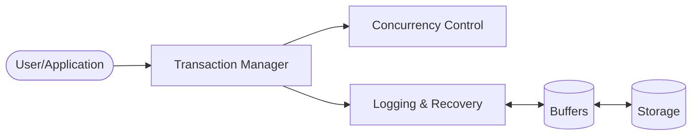

This lecture will precisely cover the four ACID properties.

## A - Atomicity
A transaction is an **atomic unit of processing**:

* An indivisible unit of execution.
* Executed in its entirety or not at all.

Deals with failure:

* User aborts a transaction (cancel button).
* System aborts a transaction (deadlock).
* Transaction aborts itself (unexpected database state).
* System crashes, network failure and more.

There are two possible outcomes:

* **Abort** - An error prevented full execution:
	* We undo the work done up to the error point. The system re-creates the database state as it was before the start of the aborted transaction.
* **Commit** - No error and the entire transaction executes:
	* The system is updated correctly.
	
## C - Consistency
A correct execution of the transaction must take the database from one consistent state to another consistent state. 

There are two definitions of this property:

* **Weak Version** - Transaction may not violate constraints.
	
	This is the typical definition. Constraints are things such as relations and data-types.
	{:.info}
* **Strong Version** - It should correctly transform the database state to reflect the effect of a real world event. (ISO/IEC 10026-1:1998)
	
Due to the two definitions this can be hard to verify.

### Transactions & Consistency
We can assume that transactions preserve consistency as:

> Transactions (if run on their own) always transform a **consistent** database state into another  **consistent** database state.

Transactions can only produce one of two outcomes:

* **Commit** - Execution was successful and the database is left in a consistent state.
* **Abort** - Execution was not successful and we need to restore the database to the state is was in before.

## I - Isolation
A schedule satisfies isolation if and only if ($\iff$) it is **serialisable**

* As serialisable transactions share the same properties as multiple transactions they can be considered consistent.
* Additionally, a schedule is serialisable if and only if ($\iff$) it satisfied isolation.

### SQL Isolation Levels
The SQL standard divides isolation into several levels:

1. **Read Uncommitted** (no isolation) - It is fine if you read data which has not been committed.
1. **Read Committed** - Everything you read must have been committed before you can see it.
1. **Repeatable Read** - Above and if you read the same thing twice in a transaction, you must get the same return value.

	Other transactions don't affect this transaction's reads.
	{:.info}
1. **Serialisable** - Above and a serial schedule is followed.

Isolation level 4 is the default meaning of isolation.
{:.info}

Some implementations have more levels.
{:.info}

You can set the isolation level with the following statement:

```sql
SET TRANSACTION READ WRITE
	ISOLATION LEVEL READ UNCOMMITTED;
```

`TRANSACTION` can also be set to `READ ONLY`.
{:.info}

## D - Durability
Once a transaction commits and changes the database, these changes cannot be lost because of subsequent failure.

It could be overwritten by a later update.
{:.info}

We **redo** the transaction if there are any problem after the update.

Durability deals with things like media failure.
{:.info}

## ACID & Relational DBMS Components
There are several components in a DBMS:



Two of which are used  to satisfy ACID:

* **Atomicity** - Via recovery control (Logging & Recovery)
* **Consistency** - Via scheduler (Concurrency Control)
* **Isolation** - Via scheduler (Concurrency Control)
* **Durability** - Via recovery control (Logging & Recovery)