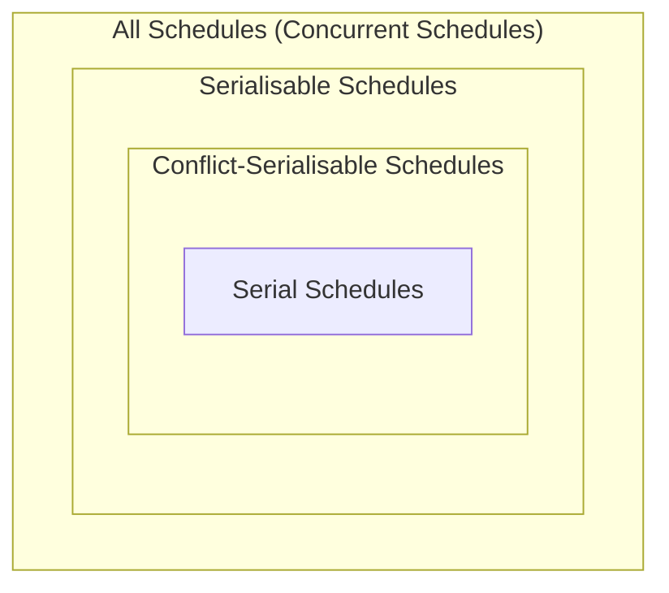

This is how we calculate **quickly** how much concurrency we can allow while satisfying **isolation** and **consistency**.

## Conflict-Serialisability
This is a stronger from of serialisability that is used by most commercial DBMS. It is base on the notion of **conflict**:

> A **conflict** in a schedule is a pair of operations, from **different** transaction, that **cannot** be swapped without changing the behaviour of at least one of the transactions.

$$
r_1(X); \underbrace{w_1(X); r_2(X)}_\text{conflict}; w_2(X); r_1(Y); w_1(Y);
$$

Look for a write, then read, from different transactions. Read, then write, is okay.
{:.info}

### Conflicts
A conflict in a schedule is a pair of operations:

1. From different transactions.
1. That access the same item.
1. At least one of them is a write operation.

### Conflict-Equivalency
Two schedules $S$ and $S'$ are **conflict-equivalent** if $S'$ can be obtained from $S$ by swapping any number of: **consecutive**, **non-conflicting**, operations from **different transactions**.

#### Example
You want to order the transactions to make it serial:

$$
\begin{aligned}
S:& r_1(X); w_1(X); w_2(X); \mathbf{r_2(Y); r_1(Y)}; w_1(Z)\\
& r_1(X); w_1(X); \mathbf{w_2(X); r_1(Y)}; r_2(Y); w_1(Z)\\
& r_1(X); w_1(X); r_1(Y); w_2(X); \mathbf{r_2(Y); w_1(Z)}\\
& r_1(X); w_1(X); r_1(Y); \mathbf{w_2(X); w_1(Z)}; r_2(Y)\\
S':& r_1(X); w_1(X); r_1(Y); w_1(Z); w_2(X); r_2(Y)
\end{aligned}
$$

A schedule is **conflict-serialisable** if it is **conflict-equivalent** to a serial schedule.
{:.info}

## Hierarchy of Schedules
All of the types of schedules shown so far are represented below:

Inclusions in the diagram are strict.
{:.info}

