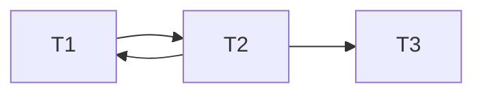
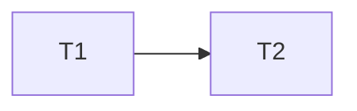
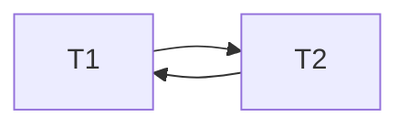
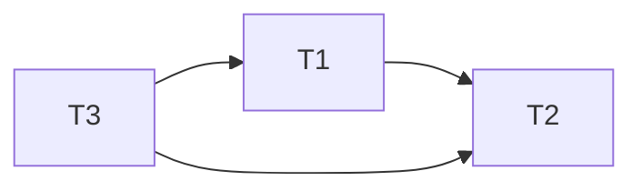

## Converting Schedules to Precedence Graphs
The precedence graph for a schedule $S$ is defined as follows:

* It is a **directed** graph.
* Its nodes are the **transactions** that occur in $S$.
* it has an edge from transaction $T_i$ to transaction $T_j$ if there is a conflicting pair of operations $op_1$ and $op_2$ in $S$ such that:
	* $op_1$ appears before $op_2$ in $S$.
	* $op_1$ belongs to transaction $T_i$.
	* $op_2$ belongs to transaction $T_j$.

### Example
Convert the following schedule to a precedence graph:

$$
S: r_2(X); r_1(Y); w_2(X); r_2(Y); r_3(X); w_1(Y); w_3(X); w_2(Y);
$$

Connections are made on operations that overwrite existing variables (operations from different transactions that cannot be swapped without changing the behaviour of at least one transaction):



## Testing Conflict-Serialisability

1. Construct the precedence graph for $S$.
1. If the precedence graph has **no cycles**, then $S$ is conflict-serialisable.

### Examples

1. $S: r_1(X); w_1(X);$ $r_2(X); w_2(X);$ $r_1(Y); w_1(Y);$ $r_2(Y); w_2(Y)$:

	```mermaid
	graph LR
	T1 --> T2
	```
	
	There are no cycles so $S$ is conflict-serialisable.
	{:.info}
1. $S: r_2(X); r_1(Y);$ $w_2(X); r_2(Y);$ $r_3(X); w_1(Y);$ $w_3(X); w_2(Y)$:

	```mermaid
	graph LR
	T1 --> T2 --> T3
	T2 --> T1
	```
	
	There is a cycle to $S$ is not conflict-serialisable.
	{:.error}

## Meaning of Precedence Graphs
The following graph:



means that an operation in $T_1$ **must** occur before an operation in $T_2$.

This means that in a **cycle** you are unable to determine the true order of operations as the transactions are **co-dependant**.



For a full proof by contradiction see [the slides and lecture video](https://liverpool.instructure.com/courses/46572/pages/recognizing-a-conflict-serializable-schedule).
{:.info}

## Constructing a Serial Schedule
Consider that you have the following schedule and you want to make it serial:

$$
S: r_1(Y), r_3(Y), r_1(X), r_2(X), w_2(X), r_3(Z), w_3(Z), r_1(Z), w_1(Y), r_2(Z)
$$

This is the equivalent precedence graph:



To find the serial schedule:

1. Find a transaction with only outgoing edges.
1. Put this transaction in your schedule and remove it from the graph.

Following these rules yields the following **serial-schedule**:

$$
S': r_3(Y), r_3(Z), w_3(Z), r_1(Y), r_1(X), r_1(Z), w_1(Y), r_2(X), w_2(X), r_2(Z)
$$