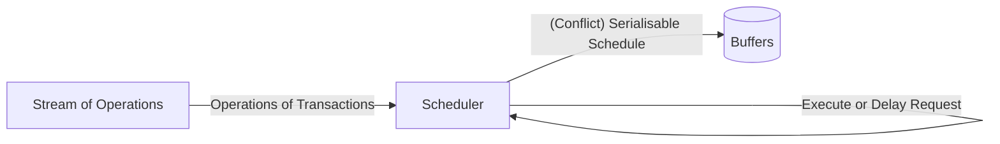
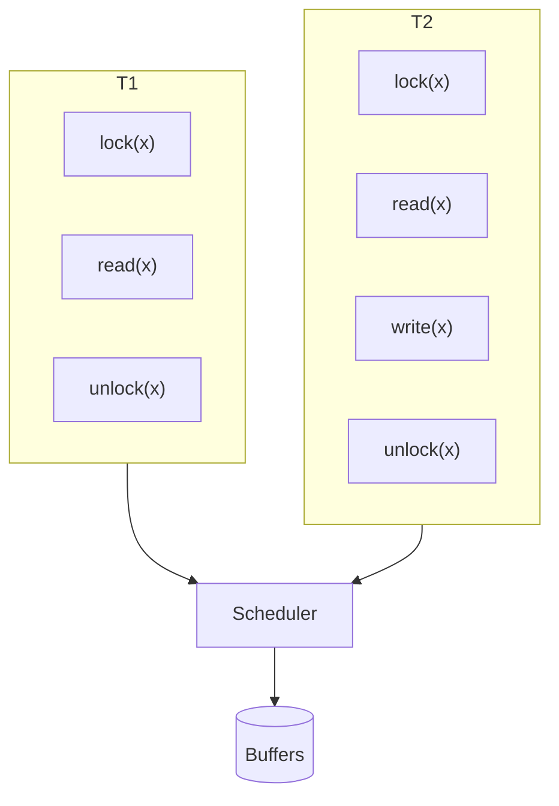

## Transaction Scheduling in a DBMS
Transaction scheduling looks like the following inside a DBMS:

This needs to be completed live, as transactions come into the system.
{:.info}

## Using Locks
This is a simple version of locking. There are more advanced versions in other lectures.

### Simple Locking Mechanism
A transaction has to **lock** an item before it accesses it.

Locks are requested from and granted by the scheduler:

* Each item is locked by at most one transaction at a time.
* Transactions wait until a lock ca be granted.

Each lock as to be **released** (unlocked) eventually.
{:.info}

The other transaction is blocked from going into a locking state unless the resource is free.
{:.info}

### Schedules With Simple Locks
We can extend the syntax for schedules by including the following two operations:

* $l_i(X)$ - Transactions $i$ requests a lock for item $X$.
* $u_i(X)$ - Transaction $i$ unlocks item $X$.

The previous graph could then be shown in the following shorthand:

$$
S: \mathbf{l_1(X)};r_1(X);\mathbf{u_1(X);l_2(X);}r_2(X);w_2(X);\mathbf{u_2(X)};
$$

The rules for simple locking are:

* For each $r_i(X)/w_i(X)$ there is an earlier $l_i(X)$ without any $u_i(X)$ occurring between $l_i(X)$ and $r_i(X)/w_i(X)$.
	
	A lock must be created for reads and writes to an object.
	{:.info}	
* For each $l_i(X)$ there is a later $u_i(X)$.
* If $l_i(X)$ comes before $l_j(X)$, then $u_i(X)$ occurs between $l_i(X)$ and $l_j(X)$.
	
	An object can only be locked by a single transaction at a time.
	{:.info}

#### Not Serialisable
There are transactions, when they are combined with this locking technique, that produce different results compared to when they are executed serialy. 

This method may **not** produce serialisable results.
{:.error}

### Two-Phase Locking (2PL)
We can change the simple locking mechanism so that it **guarantees conflict-serialisability** .

The condition is:

* In each transaction, all lock operations should **precede** all unlocks.

Therefore the transaction takes place in two phases:

* **Phase 1 - Request locks** and possibly other read/write operations.
* **Phase 2 - Unlock** and possible other read/write operations.

A transaction is 2PL if all locks are completed before any unlocks.
{:.info}

