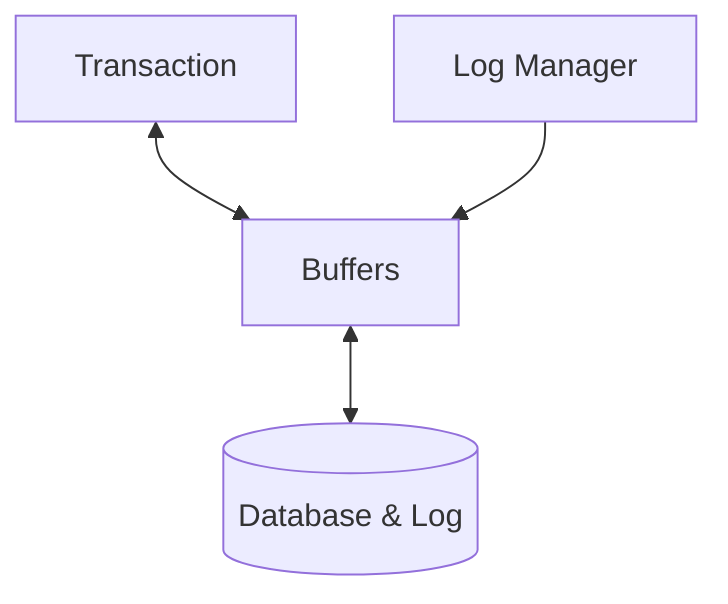

## Logging
The following activities should be written to the log so that a desired database state can be recovered later:

* **Starts** of transactions, commits and aborts.
* **Modification** of database items.

This should be implemented in such a way that it should work *even* if the system fails.

You can use the following techniques:

* Undo Logging (Maintains atomicity.)
* Redo Logging (Maintains durability.)
* Combinations of the two which allow for atomicity and durability.

## Logging Transaction Syntax
A DBMS can be modelled like so:

The following addition transaction syntax are required for logging:

* `write(X)` - Writes changes **only** to the buffer.
* `output(X)` - Copy database item $X$ from the buffer to the database.
* `flush_log` - Write log entries that are currently residing in main memory (buffer) to the log.

## Undo Logging
This logs the database activities with the goal of restoring a previous state:

To do this we should have **log entries** for the following:

* `START T>` - Transaction $T$ has started.
* `COMMIT T>` - Transaction $T$ has committed.
* `<ABORT T>` - Transaction $T$ was aborted.
* `<T, X, v>` - Transaction $T$ has updated the value of database item $X$, and the old value of $X$ was $v$.
	* This is the response to `write(X)`

	If this entry occurs in the log, then the new value of $X$ might not have been written to the database yet.
	{:.warning}
	
### Undo Logging Procedure

1. If transaction $T$ updates database item $X$, and the old value was $v$, then `<T, X, v>` must be written to the log on disk **before** $X$ is written to the disk.
1. If transaction $T$ commits, then `<COMMIT>` must be written to the disk **as soon as** all database element changed by $T$ are written to the disk.

This is represented in the following transaction:

| Transaction | Comments |
| :-- | :-- |
|read(X)| |
|X := X*2| |
|write(X)| |
|read(Y)| |
|Y := Y*2| |
|write(Y)| |
|flush_log| Writes all log entries for updates to disk. |
| output(X) |Writes updates for $X$ to disk. |
| output(Y) | Writes updates for $Y$ to disk. |
|flush_log|Writes the `<COMMIT T>` record to disk|

### Example
This is a full example of the previous table:

| Time | Transaction | $X$ (Local) | $Y$ (Local) | $X$ (Buffer) | $Y$ (Buffer) | $X$ (Database) | $Y$ (Database) | Log Record Written |
| --: | :-- | --: | --: | --: | --: | --: | --: | :-- |
| 0 | | | | | | 1 | 10 | `<START T>` |
| 1 | read(X) | **1** | | **1** | | 1 | 10 | | 
| 2 | X := X * 2 | **2** | | 1 | | 1 | 10 | |
| 3 | write(X) | 2 | | **2** | | 1 | 10 | `<T, X, 1>` |
| 4 | read(Y) | 2 | **10** | 2 | **10** | 1 | 10 | |
| 5 | Y := Y * 2 | 2 | **20** | 2 | 10 | 1 | 10 | |
| 6 | write(Y) | 2 | 20 | 2 | **20** | 1 | 10 | `<T, Y, 10>`|
| 7 | flush_log | 2 | 20 | 2 | 20 | 1 | 10 | |
| 8 | output(X) | 2 | 20 | 2 | 20 | **2** | 10 | |
| 9 | output(Y) | 2 | 20 | 2 | 20 | 2 | **20** | |
| 10 | | 2 | 20 | 2 | 20 | 2 | 20 | `<COMMIT T>` |
| 11 | flush_log | 2 | 20 | 2 | 20 | 2 | 20 | |

There could be several failure scenarios:

1. `<COMMIT T>` occurs in the log on disk:
	
	$T$ has committed successfully (no recovery is needed).
1. `<COMMIT T>` doesn't occur in the log database and error is after `output(X)`:
	
	Must undo all update to database items that were written to disk.
	
	For each log record `<T, X, v>` on disk, replace $X$ on disk by $v$.
	{:.info}
1. `<COMMIT T>` doesn't occur in the log database and `flush_log` wasn't run:

	Nothing needs to occur as no logs for the transaction were written to the disk yet.
	
### Recovery with Undo Logs
If an error occurs we should traverse the log backwards and take the following actions. If the current entry is:

* `<COMMIT T>` - $T$ was committed successfully.
* `<ABORT T>` - $T$ was manually aborted.
* `<T, X, v>` - If $T$ has not finished, change the value of $X$ on disk to $v$.

Then write `<ABORT T>` for each uncommitted transaction $T$ that as not previously aborted and call `flush_log`.

## Dealing with `ABORT`
This is similar to recovery with undo logs but focuses on a single transaction:

1. Assume $T$ aborts.
1. Traverse the undo log from the last to the fisrt item.
1. if we see `<T, X, v>`, change the value of $X$ on disk back to $v$.