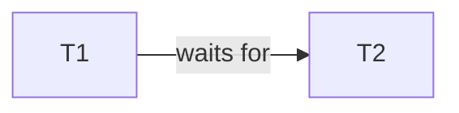

There are thee main approaches for deadlock detection:

* Timeouts - Assume a transaction is in a deadlock if it exceeds a given time limit.
* Wait-for Graphs:
	* Nodes - Transactions
	* Edge from $T_1$ to $T_2$ if $T_1$ waits for $T_2$ to release a lock.
	* Deadlock correspond to cycles.
	
	```mermaid
	graph LR
	T1 -->|waits for| T2 --> T3 --> T1
	```
* Timestamp-Based

## Timestamps
Each transaction $T$ is assigned a unique integer $\text{TS}(T)$ upon arrival. This is the timestamp of $T$.

If $T_1$ arrived earlier than $T_1$, we require $\text{TS}(T_1)<\text{TS}(T_2)$:

* If two transactions arrive at the same time then the order doesn't matter.
* If a transaction is restarted after an abortion, then the timestamp stays that same.

In this methods timestamps do not change even after a restart.
{:.info}

We then use the order of the timestamps to decide which can wait and which must abort to prevent deadlock.

### Wait-Die Scheme

> Older transactions **always** wait fro unlocks.



$T_1$ requests an item that is locked by $T_2$.
{:.info}

Therefore there can be two cases:

1. $T_1$ is older than $T_2$ - $T_1$ is allowd to wait further for $T_2$ to unlock.
1. $T_1$ is younger than $T_2$ - $T_1$ is rolled back and dies.

Only **older** transactions are allowed to wait so no cyclic dependencies are created.

### Wound-Wait Scheme

> Older transactions **never** wait for unlocks.


1. $T_1$ is older than $T_2$ - $T_2$ is rolled back unless is has finished (it is wounded).
1. $T_1$ is younger than $T_2$ - $T_1$ allowed to wait further for $T_2$ to unlock.

Only **younger** transactions are allowed to wait so no cyclic dependencies are created.

This works as eventually, any finite number of transactions finishes under wound-wait. Therefore, at all times, the oldest transaction can move.
{:.info}