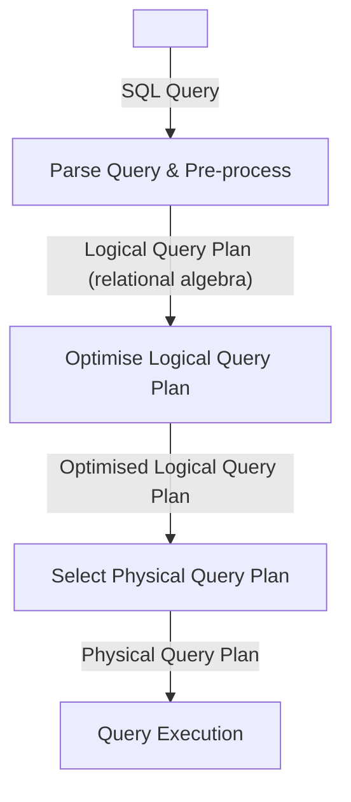
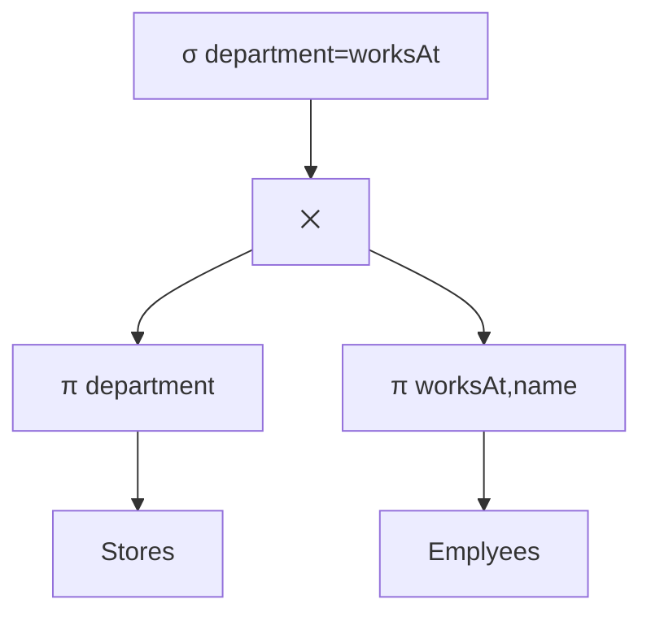

The **query compiler** and **execution engine** are responsible for:

* Transforming SQL queries into sequences of database operation.
* Executing these operations.

## Query Processing
Query processing is completed in the following order:



## Relational Algebra
The following set of operation can be applied to relations to compute new relations:

* Selection ($\sigma$)
* Projection ($\pi$)
* Cartesian Product ($\times$)
* Union ($\cup$)
* Renaming ($\rho$)
* Natural Join ($\bowtie$)
* Semijoin ($\ltimes$)

These are covered in prior lectures.
{:.info}

### Query Plan
A **relation algebra expression** that is obtained from an SQL query is also called a **(logical) query plan**.

The following **query**:

```sql
SELECT department, name
FROM Stores, Employees
WHERE department=worksAt AND city='Liverpool';
```

can generate the following **query plan**:

$$
\pi_\text{department, name}(\sigma_\text{department=worksAT AND city='Liverpool'}(\text{Stores}\times\text{Empoyees}))
$$

You can also represent this as a tree:



* **Leaves** - Input Relations
* **Inner Nodes** - Operators

#### Equivalent Query Plans
There are typically **many different query plans**. The DBMS aims to **select a best possible query plan**.

Relational algebra is better suited than SQL for this:

* Can use **equivalence laws** of relational algebra to generate a query plan for the same query that can be executed faster.

	For example:
	
	$$
	\sigma_\text{condition}(R_1\bowtie R_2)=\sigma_\text{condition}(R_1)\bowtie\sigma_\text{condition}(R_2)
	$$
	
	```mermaid
	graph
	subgraph Slow
	sig[σ condition] --> bow["⋈"] --> R1 & R2
	end
	
	subgraph Parallel
	bow2["⋈"] --> sig1[σ condition] & sig2[σ condition]
	sig1 --> R12[R1]
	sig2 --> R22[R2]
	end
	```