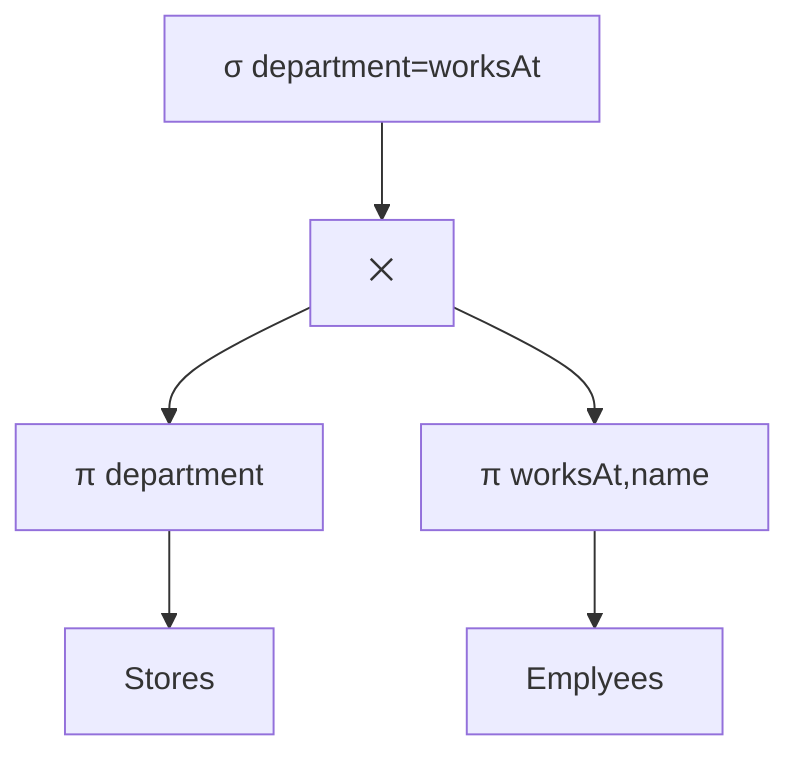

## Executing Query Plans
A query plan tells us exactly how to computer the result to a query. On a particular tree we should proceed from bottom to top:

* Compute an **intermediate result** for each node.
* For a **leaf** labelled with relation $R$, the intermediate result is $R$.
* For an **inner node** labelled with operator $op$, get the intermediate result by applying $op$ to the childrens' intermediate results. 
* **Result of the query** - intermediate result of the root.

We go from bottom to top, applying the operation on the last table(s).
{:.info}

## How to Apply an Operator

* Computing $\sigma_\text{condition}(R)$
	* We have to read the entire file $R$. If the intermediate is sorted or has an index there are methods of doing this without reading the whole table.
* Computing $\pi_\text{attribute list}(R)$
	* Similar to $\sigma$, read $R$ only once.

### Naïve Computation of Joins
We can use the following nested loop algorithm:

> Compute $R\bowtie S$:  
> for each tuple $r$ in $R$:  
> &emsp;for each tuple $s$ in $S$:  
> &emsp;&emsp;if $r$ and $s$ have the same value for all common attributes:  
> &emsp;&emsp;&emsp;output $r\bowtie s$

This algorithm is slow as for each tuple $r$ in $R$ we have to read the entire relation $S$.

The running time is:

$$
O(\lvert R\rvert\times\lvert S\rvert)
$$

Where:

* $\lvert R\rvert$ - Number of tuples in $R$.
* $\lvert S\rvert$ - Number of tuples in $S$.