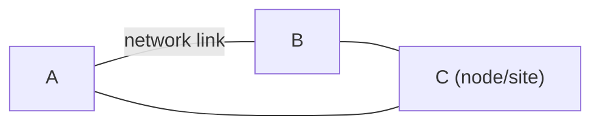

We want to have databases at **several sites**, which only hold data that is **primarily relevant** to them.

## Distributed Databases
They are a:

* Collection of multiple **logically interrelated** databases.
* **Distributed** over a computer network.

* The databases are connected by a **network link**.
* **Nodes/sites** are where the databases are stored.

### Advantages

**Performance Improvements**:

* Answer queries faster by distributing tasks over the nodes.
* Reduces CPU time, disk accesses, communication cost and more at **individual** nodes.

**Scalability**:

* Easier extension of the system for capacity and performance.
* Just add a new node.

**Resilience**:

* Data can be replicated at geographically separate sites.
* Catastrophic failures don't affect the entire system