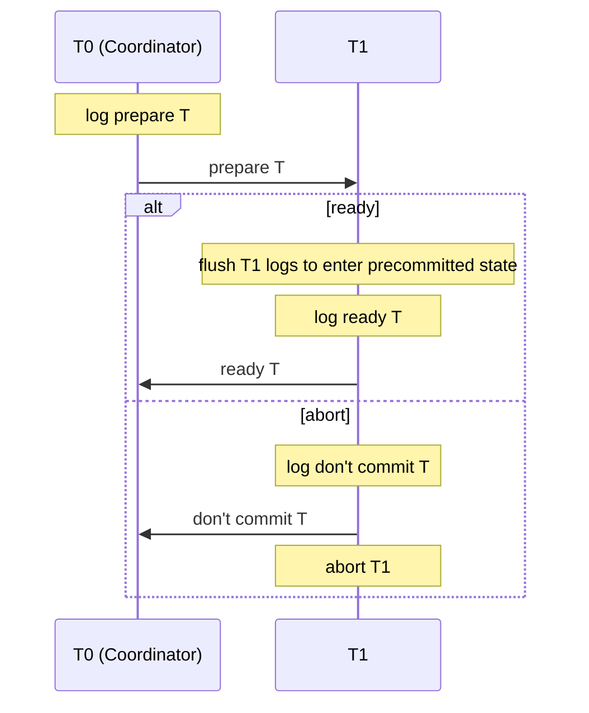
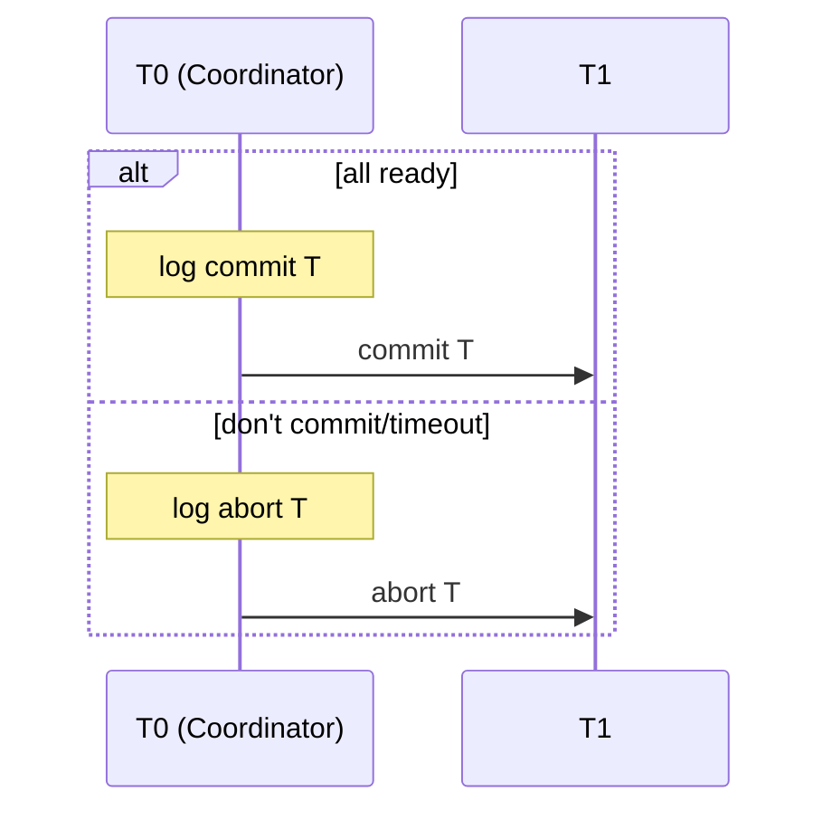

## Concurrency Control
### CC in DDBMS Using Locks
Locks for concurrency control can be used in many different ways:

| | No Backups | Backups |
| :-- | :-- | :-- |
| One Authority | One computer does all the locks. | There are backups if the primary fails. |
| Many Authorities | Database items can have different computers in charge of their locks. | Many authorities with backups.

There are various **downsides** to these methods:

* One Computer
	1. If it fails you need to restart the whole system.
	1. There are too many transactions requiring locks.
* Backup of One Computer
	* Must be synced with the primary computer.
* Many Authorities
	* Must be synced with the primary computer.
* Many Authorities with Backups
	1. Must be synced with the primary computer.
	1. Must be synced with the primary computer.

### CC in DDBMS using Voting

1. Each site with a copy of an item has a local lock that it can grant transaction for that item.
1. If a transaction gets over half the local locks for an item, it has a global lock on the item.
	* If so, it must tell the sites with a copy that it has the lock.
	* If it takes too long, it must stop trying to get the lock.

This method is much more distributed but requires more communication.

## Recovery in DDBMS
### Violation of Atomicity
Even though atomicity is enforced at **individual** locations it can be violated **globally**. 

This is because nodes can **fail** during the execution of a **global** transaction.

#### Two-Phase Commit Protocol
This is the protocol that is used to enforce **atomicity** in **global** transactions.

This is not related to 2PL.
{:.error}

There is a single **coordinator** on the network that decides when local transaction can commit.

**Logging** is handled at each node locally:

Messages sent and received from other nodes are logged too.
{:.info}

The two phases are as follows:

1. **Decide When to Commit or Abort**
	1. Send `prepare T` to ask the nodes if they want to commit.
	2. At each node decide whether to commit or abort:
		* If commit, go into **precommitted** state and send back `ready T`.
			
			Only the coordination can abort once a node is in a precommitted state.
			{:.info}
		* If abort, send back `don't commit T` and abort local transaction.
1. **Commit or Abort**
	* If all nodes respond `ready T`:
		* Send `commit T` to all the nodes.
	* If some node responds `don't commit T` or there is a timeout waiting for a reply:
		* Send `abort T` to all nodes.

#### Two-Phase Logging
The logging for **phase 1** is like so:

`alt` means that you can take either path in the sequence diagram.
{:.info}

The logging for **phase 2** is like so:

#### Three-Phase Commit Protocol
In the two-phase commit protocol, if the coordinator and another transaction fails, durability could be broken when aborting the transaction.

To fix this we can split **phase 2** into two parts:

1. **Prepare to Commit**
	1. Send the decision (commit/abort) to all nodes.
	1. Nodes go into prepare-to-commit state.
1. **Commit**
	* The old phase 2.