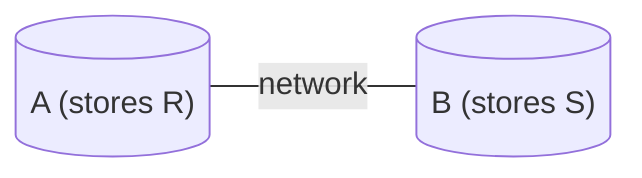

If we don't have all the information we need for a query at a node, we need to request information from other sites:

* This is very **slow**.
* **Joins** are the most expensive operation.

## Joins
We can often send less than the whole table over the network when completing joins.

### Semijoins ($\ltimes$)
We can deduce that:

$$
R\ltimes S=R\bowtie \pi_{\text{common attributes of }R\text{ and }S}(S)
$$

$R\ltimes S$ is the set of all tuples in $R$ that `NATURAL JOIN` at least one tuple in $S$.
{:.info}

Therefore we can save on network communications by only sending the part of $S$ that is needed.

#### Semijoin Reduction

We can then use this to create an optimised method to calculate $R\bowtie S$ at site $B$ (which stores $S$).

1. Site $B$ sends $S':=\pi_{\text{common attributes of }R\text{ and }S}(S)$ to site $A$.
1. Site $A$ sends $R':=R\ltimes S(=R\bowtie S')$ to site $B$.
1. Site $B$ outputs $R'\bowtie S$

There is an example, with attribute names, at the end of [the lecture](https://liverpool.instructure.com/courses/46572/pages/query-processing-for-ddbms?module_item_id=1218353).
{:.info}

The cost of this communication is:

$$
\lvert S'\rvert\times(\text{size of tuple in }S')+\lvert R'\rvert\times(\text{size tuple in }R') 
$$

#### Efficiency
This method is sometimes more efficient than just exchanging the whole table depending on:

* Is the projection much smaller than the full relation?
	* This is better.
* Is the size of the semi-join much smaller.
	* This is better.

In general, this solution is optimal if:

$$
\lvert\pi_\text{common attributes}(S)\rvert+\lvert R\ltimes S\rvert <\lvert R\rvert
$$

In the worst case you can send twice the size of $R$.
{:.info}