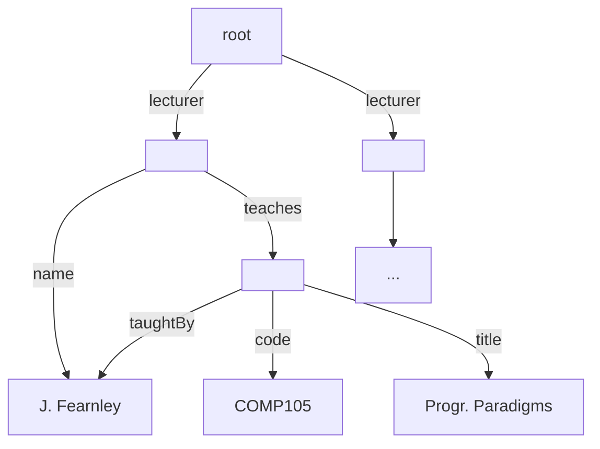

Semi-structured data lies between fully structured data (like relational databases) and unstructured data (like arbitrary data files).

* Semi-structured data doesn't have to fit to a **schema**.
* Programs have to know how to read & interpret the data.
* Semi-structured data is self describing and flexible.

## Semi-Structured Data Model
Semi-structured data is typically a tree with the following properties:

* **Leaf Nodes** - Have associated **data**.
* **Inner Nodes** - Have edges going to other nodes:
	* Each edge has a **label**.
* **Root**:
	* Has no incoming edges.
	* Each node is reachable from the root.
	

## Applications
They are a popular form for storing and sharing data on the web.

Also are used for the storage of documents such as:

* Word processor documents.
* Spreadsheets.
* Vector Graphics.

## Implementations

* XML (eXtensible Markup Language)
	* Tree structured data.
* JSON (JavaScript Object Notation)
	* Similar to XML
* Simple Key-Value Relationships:
	* Correspond to very simple XML/JSON documents.
* Graphs
	* A general form of semi-structured data.