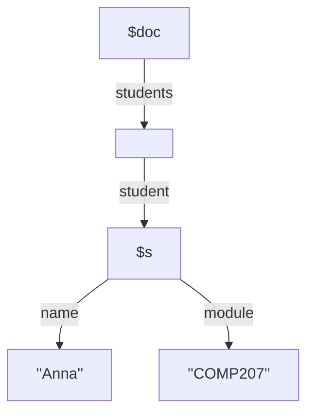

This is a method of running queries on XML. They are an extension of XPath and therefore every XPath is an XQuery expression.

For additional XQuery examples see [this lecture video](https://liverpool.instructure.com/courses/46572/pages/xquery-examples?module_item_id=1218364)
{:.info}

## Syntax
For the following tree:



an XQuery could look like the following:

```
let $doc := doc("students.xml")
for $s in $doc/students/student
where $s/module = "COMP207"
return $s/name
```

This is case sensitive.
{:.info}

### FLWR Expressions

| Clause | Requirement |
| :-- | :-- |
| `for` & `let` | Any number, interleaved.<br>Some interpreters require at least one `let`. |
| `where` | Optional |
| `return` | Mandatory |

Therefore we can get the following smallest expressions depending on the implementation:

```
return <greeting>Hello World!</greeting>
```

```
let $hello := <greeting>Hello World!</greeting>
return $hello
```

### Clauses

* `let`
	* `for variable in XQuery expression`
	* Assigns the result of an expression to a variable.
* `for`
	* `let variable := XQuery expression`
	* For each item in the result of the expression assign it the the variable.
* `where`
	* `where condition 1, condition 2, ...`
	* If all the conditions are true then execute the return clause.
	* You can also use the following syntax:
	
	```
	where some/every $var in XQuery expression satisfies condition
	```
	
	Comparisons between expressions `$s1/name = $s2/name` may not have the tags removed.
	{:.warning}