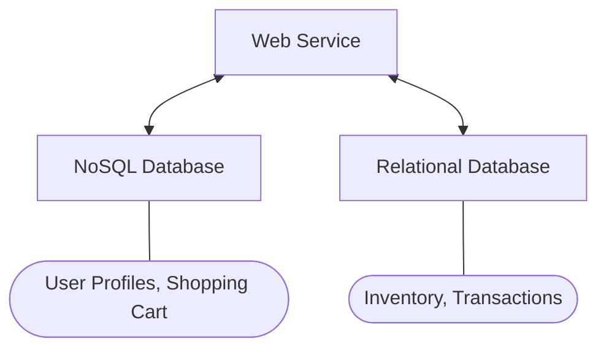

These are non-relational databases that *generally* cater to web applications:

* Very fast access, will millions of users in parallel.
* Vault Tolerance
* Semi-structured
	* Flexibility in the type of data stored.
* Full ACID compliance can sometimes be relaxed.

## NoSQL Example
Consider that you have the following setup:

We can store data that must be compliant on the relational database and high volume, non-compliant data can be stored on the noSQL database.

In the NoSQL database we can use tables like so:

| Key | Value |
| :-- | :-- |
| User1 | {"name":"John Smith", "items":{ "1":{"name":"product 1","quantity":3} ...} } |

They have the following properties:

* Simple Queries:
	* Return teh value for key $k$.
* Fast reads/writes via index on keys.
* ACID can sometimes be relaxed.

## NoSQL Characteristics
NoSQL databases are often **distributed**:

* Nodes run on commmidity hardware.
* Standard network.

They are designed to guarantee:

* **Availability** - Every non-failing node always executes queries.
* **Consistency** - Every read receives the most recent write or an error.
	
	This is **not** the same as in ACID
	{:.warning}
* **Scalability** - More capacity by adding new nodes.
* **High Performance** - Supports few, fast, interfaces.
* **Partition-Tolerance** - Even if nodes, or messages, fail - the remaining sub-network can continue their work.

They often give up ACID to improve performance.
{:.info}

## The CAP Theorem
This theorem says we can only choose **two** of:

* Consistency
* Availability
* Partition-Tolerance

* Single node DBMS can have **C** and **A**
* NoSQL can have **C** and **P** *or* **A** and **P**.

## BASE
NoSQL databases drop ACID and often provide the weaker guarantee of:

* **B**asically
* **A**vailable
* **S**oft State
* **E**ventually Consistent

Soft state & eventual consistency mean that the database might occasionally be inconsistent but will eventually be consistent after propagation occurs.
{:.info}

## NoSQL Classification

* Key-Value Stores
	* Efficient lookups and insertions of key-value pairs.
* Document Stores
	* Similar to key-value stores, where the value is a semi-structured datatype.
	* Lookups can involve values from the documents.
* Column Stores
* Graph Databases