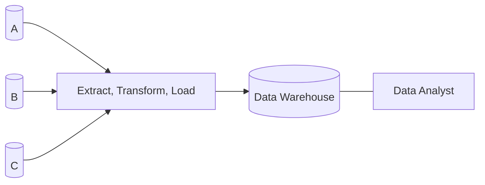

Consider that a big company wants analyse its product sales. They have a database with the following schema:

```
Sales(productNo, date, store_name, price)
Stores(name, city, country, phone)
```

and will run the following query:

```sql
SELECT country, AVG(price)
	FROM Sales, Stores
	WHERE Sales.store_name = Stores.name AND
		date >= '2021-01-01'
	GROUP BY country;
```

This requires most of the data in the database which will **block** large parts of the database:

* This should be avoided on DBMSs serving many users.

## Data Warehouses
These are specific facilities made to support data analysis. 



The warehouse isn't constantly updated. Only every day or so.
{:.info}

## Online Analytic Processing (OLAP)
Online analytic processing is the process of analysing complex data store in data warehouse.

This is in **contrast** to **online transaction processing (OLTP)** which are traditional DBMS tasks:

* Queries and updates that can be executed fast.
* Only affect a small portion of the database.

## Fact Tables & Data Cubes
In OLAP applications, there is typically a **unique fact table** that:

* Represents events & objects of interest for the analysis.

**Data cubes** allow us to represent an attribute as a point in 3D space. For example, for the fact table:

```
Sales(productNo, date, store, price)
```

we can have axes of:

* `productNo`
* `date`
* `store`

which will point to a specific `price`.

There are examples of **slicing** and **dicing** data cubes using star schema [at the end of the slides](https://liverpool.instructure.com/courses/46572/pages/more-details-about-data-analysis?module_item_id=1218371).
{:.info}

### Star Schema
These are:

* Unique **fact tables** that contain all the points in the data cube.
* **Dimension Tables** - Describe the values along each axis.

From the following schema:

```
Products(productNo, type, model)
Days(date, day, week, month, year)
Stores(name, city, country, phone)
```

you can make the following star schema:

```
Sales(productNo, date, store, price)
```

This has the **dependant attribute** of `price`.
{:.info}

#### Star Schema General Form
A **star schema** describes a database consisting of:

* A **fact table** $R(A_1,\ldots,A_n,B_1,\ldots,B_m)$ where:
	* $A_1,\ldots,A_n$ are called **dimensions**.
	* $B_1,\ldots,B_m$ are called **dependent attributes**.
* **Dimension table** $D_i(A_i\ldots)$ for each dimension $A_i$.

#### Characteristics of Star Schema
Unlike typical databases star schema have a denormalised schema:

* Main data in one table (fact table).
* Rest of the data can be joined with the fact table very quickly.

As a result we get the following:

* Queries don't requires many joins.
* Performance gains, especially when processing queries that would require many joins in a normalised database.
* Faster and easier aggregation of data.