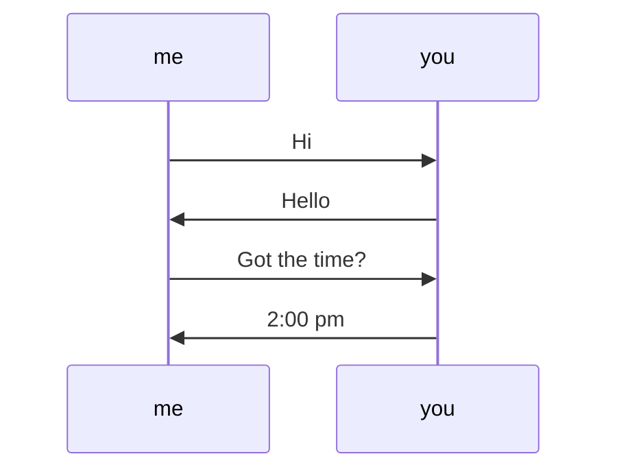

## Overview of the internet
There are several different types of devices that make up the internet.

* **Hosts** - Devices/end systems that are at the edge of the network.
* **Packet switches** - Routers/switches that forward packets to other devices.
* **Communication links** - Fibre/copper/radio transmission links between devices.
* **Networks** - A collection of devices, routers and links managed by an organisation. These can be:
	* Mobile networks.
	* Home networks.
	* Enterprise networks.
	* Local ISPs
	* National ISPs
	* Content provider networks
	* Datacenter networks
	
The internet is a network of networks that are generally enabled by **interconnected** ISPs.

### Protocols
Control the sending and receiving of messages. There are many different types for different purposes.

#### Internet Standards
There are certain organisations that maintain open protocols for the internet:

* RFC - Request for comments.
* IETF - Internet engineering task forces.

### Services
**Infrastructure** provides services to applications. These services provide a programming interface to distributed applications:

* **Hooks** - Allow sending receiving app to use the internet as a transport service.
* APIs provide service options analogous to the postal service.

## Protocol Overview

>Define the format, order of messages sent and recieved among network entities, and action taken on message transmission, and receipt.

To find the time the following sequence of actions might happen:

