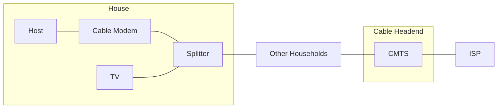
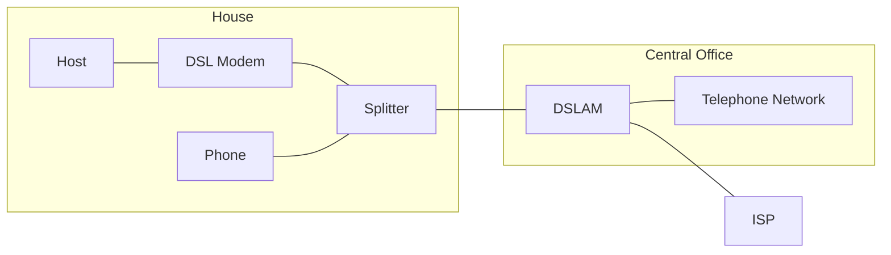

The network edge is made up of the following devices:

* **Hosts** - Clients and servers.
* **Servers** - Often in data centres.

The hosts are connected to the internet via access networks through physical media:

* Wired links
* Wireless links.

The hosts are then connected to the network core which are a set of **interconnected routers**.

## Access Networks & Physical Media
To connect a host to an edge router you would use:

* Residential networks.
* Institutional/enterprise networks.
* Mobile networks.

These connections have the properties:

* Bandwidth/transmission rate.
* Shared or dedicated access.

### Cable Internet
This is a single coaxial cable that uses **frequency division multiplexing** FDM to split the frequency bands for different purposes and users.

* CMTS - Cable modem termination system.
* HFC - Hybrid fibre coax
	* An asymmetric connection with 40 Mbps - 1.2 Gbps downstream, 30 - 100 Mbps upstream.

Homes **share** network access to the cable hardened.
{:.info}

### Digital Subscriber Line (DSL)
Uses the existing telephone line to central office DSLAM:

* Data over DSL phone line goes to the internet.
* Voice over DSL phone line goes to the telephone network.

* DSLAM - DSL access multiplexer.
* Voice and data are transmitted at different frequencies over a **dedicated** line.
* Often asymmetric connection with 24 - 52 Mbps downstream, 3.5 - 16 Mbps upstream.

### Home Networks
Often have the following:

* Cable/DSL modem
* Router, firewall, NAT
* Wired Ethernet
* WiFi AP

Several of these functions are often combined into the modem from the provider.

### Wireless Networks
A shared wireless access network that connects a host to a router.

* WLANS - Wireless local area networks:
	* Typically ~30m
	* Often use WiFi IEEE 802.11b/g/n
* Wide area cellular access networks:
	* Provide by mobile operators ~10s km
	* 10s Mbps
	* 3G/4G/5G

### Enterprise Networks
Similar home networks but often with separate components and additional hosts.

### Sending Packets
For a host to send data on a network it:

* Takes application message.
* Breaks it into smaller chunks, known as **packets**, of length $L$ bits.
* Transmits packet into access network at a transmission rate $R$.
	* $R$ is the link transmission rate or bandwidth.
	
$$\frac{L\text{ (bits)}}{R\text{ (bits/sec)}}=\text{Packet Transmission Delay}$$

### Physical Media

| Term | Definition |
| :-- | :-- |
| Bit | Propagates between transmitter/ receiver. |
| Physical link | What lies between the transmitter and receiver. |
| Guided Media | Signal propagate in solid media: copper, fibre. |
| Unguided Media | Signals propagate freely: radio. |

#### Twisted Pair (TP)
Two twisted insulated copper wires. This is the basis of the cable used for Ethernet.

* Cat 5 - 100Mbps to 1Gbps
* Cat 6 - 1 to 10Gbps

#### Coaxial Cable
Two concentric copper conductors. Multiple frequency channels are put on a cable to gain additional bandwidth.

* 100s Mbps per channel

#### Fibre Optic cable 
Glass fibre carrying light pulses, each pulse a bit.

* High speed operation ~10-100s Gbps
* Low error rate as it is immune to electromagnetic interference.

#### Unguided Media
The signal is carried in the electromagnetic spectrum. There is no physical wire. There are propagation effects from the environment:

* Reflection
* Obstruction
* Interference

There are several types of radio link types:

* Terrestrial microwave:
	* 45 Mbps channels.
* WiFi
	* Up to 100s Mbps.
* Wide-Area
	* 4G ~10 Mbps.
* Satellite
	* Up to 45 Mbps per channel.
	* 270 ms end to end delay.
	* Can gain lower latency by using low orbit vs geosynchronous satellites.