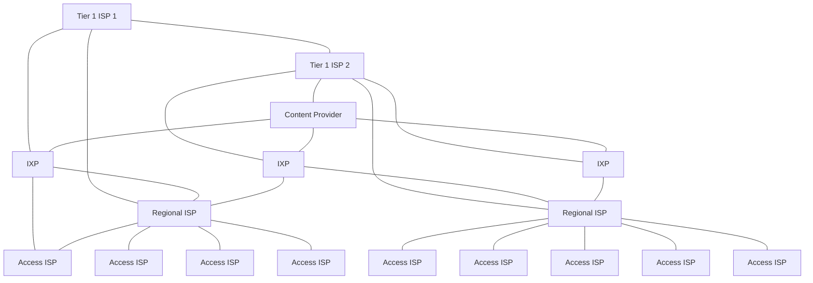

The network core is a mesh of interconnected routers. They use **packet-switching** to break the application-layer messages into **packets**:

* Forward packets from one router to the next, across links on path from the source to the destination.
* Each packet is transmitted at full link capacity.

## Store and Forward
The entire packet must arrive a a router before it can be transmitted on to the next link.

Including the transmission delay ($\frac L R$) the **end-end delay** is:

$$\text{E2E}=\frac{2L} R$$

this assumes zero propagation delay.

## Queuing Delay & Loss
If the arrival rate exceeds the transmission rate of a link then:

* Packets will queue, waiting to be transmitted on the output link.
* Packets can be dropped if the memory buffer in the router fills up.

## Network Core Functions
These are the core functions from the perspective of a router.

### Forwarding
This is a **local** action that moves the arriving packets from the router's input link to the appropriate router output link.

### Routing
This is a **global** action that determines the source-destination paths taken by packets.

Routing algorithms are used to do this.

## Circuit Switching
This is an alternative to packet switching. End-end resources are allocated to be reserved for a call between the source and destination.

* Dedicated resources
	* There is no sharing and you are guaranteed performance.
* Circuit segment is idle if not used by a call.
* Commonly used in traditional telephone networks.

Packet switching is better suited to the internet as communication is generally is bursts with lots of idle time.
{:.info}

### Frequency Division Multiplexing (FDM)
By using a modulation technique, you can split the bandwidth by frequency and transfer data on a circuit at many different frequencies.

### Time Division Multiplexing (TDM)
This method splits the entire bandwidth into time slots that can be assigned to certain users.

## Circuit Switching Evaluation

* Good for bursty data as we can take advantage of:
	* Resource sharing.
	* No call setup.
* Excessive congestion is possible:
	* Packet delay and loss due to buffer overflow.
	* Protocols need to reliable data transfer, congestion control.
* Bandwidth guarantees are still required for video and audio streaming.

## Internet Structure
In order to connect all the international ISPs together we use **global ISPs**. These global ISPs are then joined by **internet exchange points** (IXPs). Additionally content provider networks may run their own networks to bring their content closer to edge nodes.

* Tier 1 - Commercial ISPs
	* Have national and international coverage.
* Content Provider Networks - Private networks
	* Connects it data centres to the internet, often bypassing tier 1 and regional ISPs.
* IXPs - Internet Exchange Points
	* Connect ISPs to one-another.
* Access ISPs
	* The people you pay for internet service.