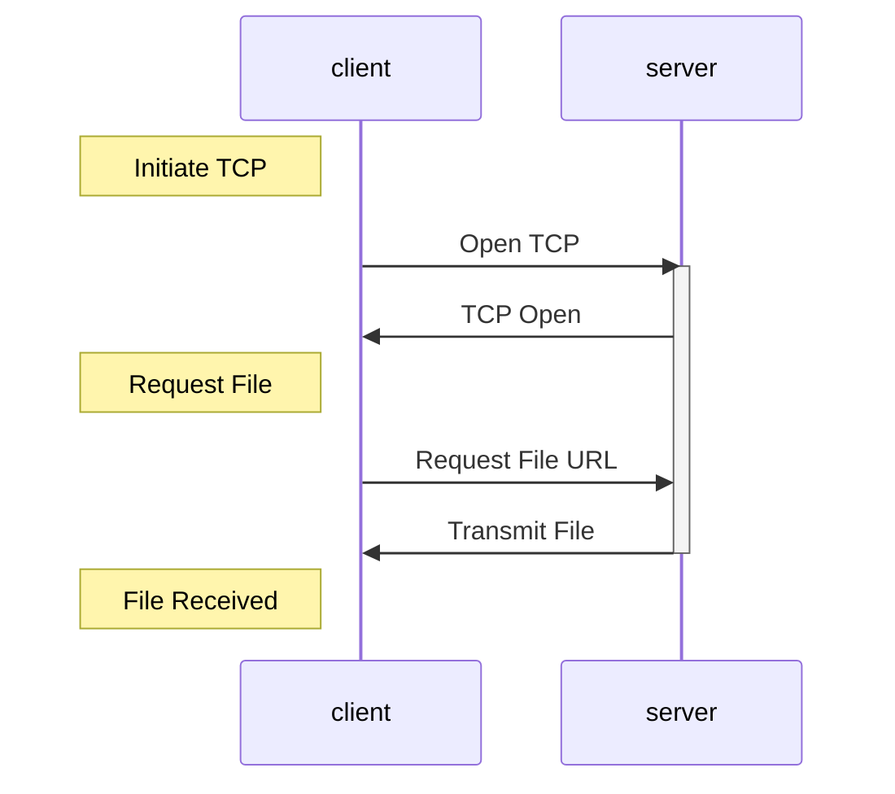

A web page is a set of several **referenced objects** which are accessible by their **URL**:

$$
\underbrace{\text{www.someschool.edu}}_\text{host name}\text{/}\underbrace{\text{someDept/pic.gif}}_\text{path name}
$$

## HTTP
This is the **application layer** protocol for the web:

* It uses a client server model.
	* Clients request and receive, servers can return objects in response to a request.
* HTTP uses TCP over port 80.
* HTTP is **stateless** - No information about past client requests are held.

	Protocols that maintain **state** are complex. The past history must be maintained and if the client or server crashes their views of state may become inconsistent.
	{:.warning}
	
### Types of Connections
There are two different types of HTTP connection:

#### Non-Persistent HTTP

1. TCP connection opened.
1. **At most one** object sent over the TCP connection.
1. TCP connection closed.

#### Persistent HTTP

1. TCP connection opened.
1. **Multiple** objects can be sent over a single TCP connection.
1. The connection is closed when finished.

### Round Trip Time (RTT)
This is the time for a small packet to travel from client to server and back.

For **HTTP 1.0** (non-persistent) the response time is:

$$
\text{HTTP Response Time}=2\times \text{RTT}+\text{File Transmission Time}
$$

from the following sequence diagram:

This is an issue as there is additional overhead in order to open and close the single TCP connections.
{:.info}

In **HTTP 1.1** (persistent) you can have as little as one RTT for all referenced objects as the connection is left open.
{:.info}