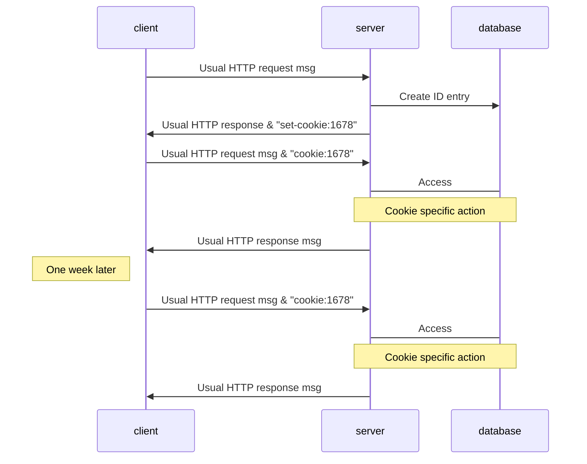
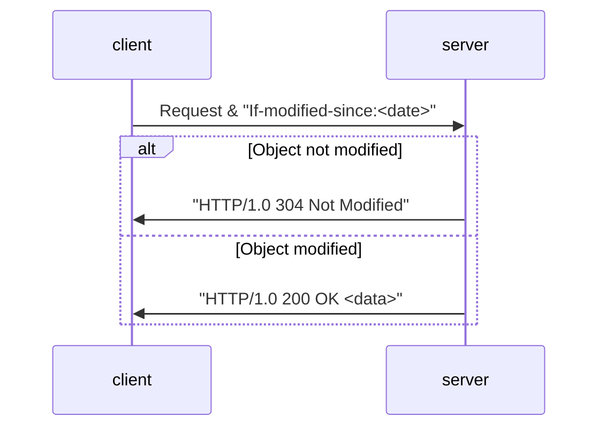

## Cookies
Cookies are used to **maintain user state**. Many websites use four components to achieve this:

1. Cookie header line of HTTP **response** message.
1. Cookie header line in next HTTP **request** message.
1. Cookie file kept on user's host, managed by user's browser.
1. Back-end database at website.

A cookie is just a unique ID number stored in a file.
{:.info}



### HTTP Cookies
Cookies can be used for:

* Authorisation 
* Shopping Carts
* Recommendations
* User Session State (Web E-Mail)

Cookies permit sites to learn a lot about you. Third party cookies allow a common identity to be tracked across multiple sites.
{:.warning}

## Web Caches (Proxy Servers)
Proxy servers allow a client request to be satisfied without involving the origin server.

* If the object is in the cache - The cache returns the object to the client.
* Else - The cache requests the object from the origin server, caches the object and sends the object to the client.

Web caching allows the following:

* Less response time for the client.
* Reducing traffic on an institutions access link.
* Enables poor content providers to operate more effectively.

### Conditional GET
This allows servers to check if their cached object is up to date. This allows:

* No object transmission delay.
* Lower link utilisation.

You can specify the date of a cached copy in the request:

```
If-modified-since: <date>
```

If the copy is up to date the server will not return the object but the following response:

```
HTTP/1.0 304 Not Modified
```

Here is the sequence of interactions:

