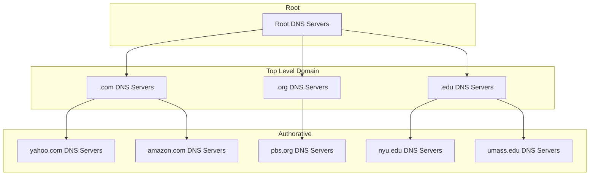

DNS allows host-names to be mapped to IP addresses:

* The DNS is implemented as a **distributed database** on a hierarchy of many **name servers**.
* It is implemented in the **application-layer** to put complexity at the network edge.

DNS allows for the following:

* Host-name to IP address translation.
* Host aliasing.
* Mail server aliasing.
* Load distribution:
	* Many IP addresses can correspond to one name.
	
## Against Centralised DNS
There are many reasons why you don't want DNS to be centralised:

* Single point of failure.
* Traffic volume.
* Can be physically distant from clients.
* Maintenance will take down the whole internet.

In order to scale the internet DNS is implemented as a **distributed database**.
{:.info}

## Hierarchy



### Root Name Servers
There are 13 logical root name servers with each server being redundant across the world. They are:

* Official last resort name servers.
* Managed by ICANN (Internet Corporation for Assigned Names and Numbers)
* Very important to the function of the internet.

### Top Level Domains
TLD servers are responsive for all top level domains (.com, .org, .net, ...) and all the country domains (.uk, .fr, .jp, ...). There are companies responsible for all top level domains.

### Authoritative Servers
There are organisations own DNS servers, providing authoritative host-name to IP mappings for an organisation named hosts.

These can be maintained by an organisation or the service provider.
{:.info}

### Local DNS Name Servers
Each ISP has a default name server. When a host makes a DNS query it is sent to it's local DNS server. This has:

* A cache of recent name-to-address translation pairs.
* Acts as a proxy, forwarding queries into the hierarchy.

## Iterated Query
DNS also allows recursive queries.
{:.info}

In the worst case the following would happen when you search for a host-name via DNS:

1. Client requests local DNS server.
1. Local DNS server requests root DNS server for top level domain.
1. Local DNS server requests TLD for authoritative domain.
1. Authoritative responds with IP address.
1. Local DNS server responds to client with IP address.

## Caching Records
Once any name server learns a mapping it is cached:

* Cache entries timeout after some time (**TTL**).
* TLD servers are typically cache in the local name servers.
	* This means taht the root name servers are not often visited.
* Cached entries may be out of date:
	* If name host changes IP address it may not be known until all TTLs expire.
* Update and notify mechanisms are proposed in IETF standard RFC 2136.

## DNS Record Types
DNS is a distributed databse that stores resource records (RR). The RR schema is:

```
RR(name, value, type, ttl)
```

There are several **types**:

* `type=A`
	* `name` is the hostname
	* `value` is the IP address
* `type=CNAME`
	* `name` is an alias name for some canonical name.
	* `value` is the canonical name.
* `type=NS`
	* `name` is the domain.
	* `value` is the host-name of the authoritative name server for this domain.
* `type=MX`
	* `value` is the name of the mail-server associated with `name`.