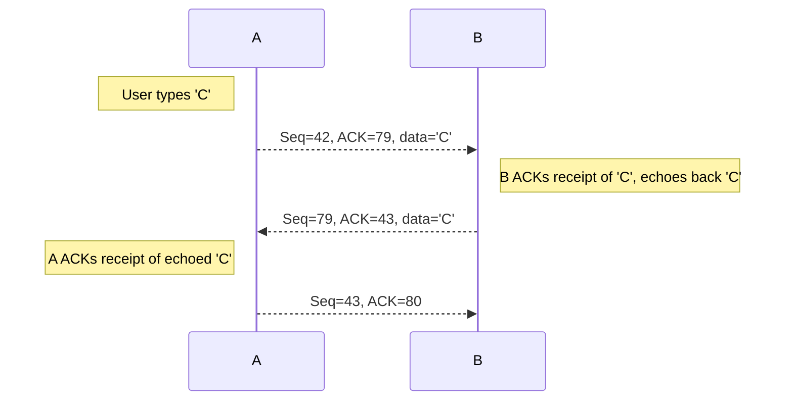

These notes are low-effort, due to catching up in this module. See [the videos and slides](https://liverpool.instructure.com/courses/54299/pages/3-transport-layer?module_item_id=1178720) for more detail.
{:.warning}

## TCP Features
TCP has the following features:

* **Point-to-Point** - one sender, one receiver
* **Reliable, In-Order Byte Stream** - no “message boundaries"
* **Full Duplex Data**:
	* Bi-directional data flow in same connection.
	* **MSS** - maximum segment size.
* **Cumulative ACKs**
* **Pipelining** - TCP congestion and flow control set window size.
* **Connection-Oriented** - Handshaking (exchange of control messages) initialises sender, receiver state before data exchange.
* **Flow Controlled** - Sender will not overwhelm receiver.

## TCP Segment Structure

* Sequence Numbers - Count the bytes of data in the byte-stream (not the sequence of the segments).
* Acknowledgements:
	* Acknowledge the sequence number of the next byte expected from the other side.
	* Cumulative ACK.

### TCP Sequence Numbers & ACKs
Here is an example of a simple telnet scenario:

## TCP Round Trip Time & Timeout
The timeout should be **longer** than the round trip time (rtt) but the rtt varies:

* Too Short - Premature timeout, unnecessary re-transmission.
* Too Log - Slow reaction to segment loss.

To get a `SampleRTT` we can measure the time from segment transmission until ACK receipt (ignoring re-transmissions). We want to smooth this out so we sample several recent rtts.

To estimate the round trip time we use an **exponential weighted moving average**:

$$
\text{EstimatedRTT} = (1-\alpha)\times \text{EstimatedRTT} + \alpha \times \text{SampleRTT}
$$

The influence of past samples decrease exponentially.
{:.info}

To calculate the **timeout interval** we include a **safety margin** that takes into account the variance of the `SampleRTT`:

$$
\text{TimeoutInterval} = \text{EstimatedRTT} + 4\times\text{DevRTT}
$$

`DevRRT` is the safety margin. It is calculated as an **exponential weighted moving average** of `SampleRTT` deviation from `EstimatedRTT`:

$$
\text{DevRTT} = (1-\beta)\times\text{DevRTT} + \beta\times\lvert\text{SamepleRTT}-\text{EstimatedRTT}\rvert
$$

Typically $\beta=0.25$
{:.info}

## TCP Sender (Simplified)
This is a simplified sender that ignores **duplicate ACKS**, **flow control** and **congestion control**.

Data received from application:

* Create segment with sequence number.
	* Sequence number is the byte-stream number of the first data byte in the segment.
* Start timer if not already running.
	* The timer is for the older unACKed segment.
	* Expiration interval is the `TimeOutInterval`.
	
Timeout:

* Re-transmit segments that caused the timeout.
* Restart the timer.

ACK Received:

* If ACK acknowledges previously unACKed segments:
	* Update what is known to be ACKed.
	* Start timer if there are still unACKed segments.
	
### Receiver ACK Generation
This covers RFC 5681:

| Event at Receiver | TCP Receiver Action |
| :-- | :-- |
| Arrival of in-order segment with expected sequence number. All data up to expected sequence number already ACKed. | Delayed ACK. Wait up to 500ms for next segment. If no segment send ACK. |
| Arrival of in-order segment with expected sequence number. One other segment has ACK pending. | Immediately send single cumulative ACK, ACKing both in-order segments. |
| Arrival of out-of-order segment higher-than-expected sequence number. Gap detected. | Immediately send duplicate ACK, indicating sequence number of next expected byte. |
| Arrivial of segment that partially completely fills gap. | Immediately send ACK, provided that segment start at lower end of gap. |

## TCP Fast Re-transmit
If a sender receives three additional ACKs fro the same data (triple duplicate ACKs), resend unACKed segment with the smallest sequence number:

* It is likely that unACKed segment was lost:
	* We can resend the data and save waiting for the timeout.