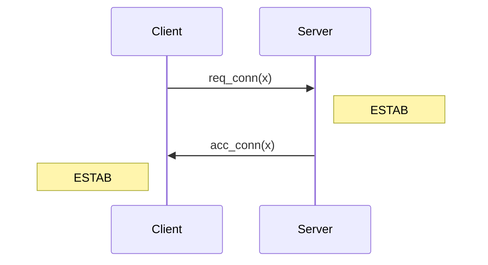
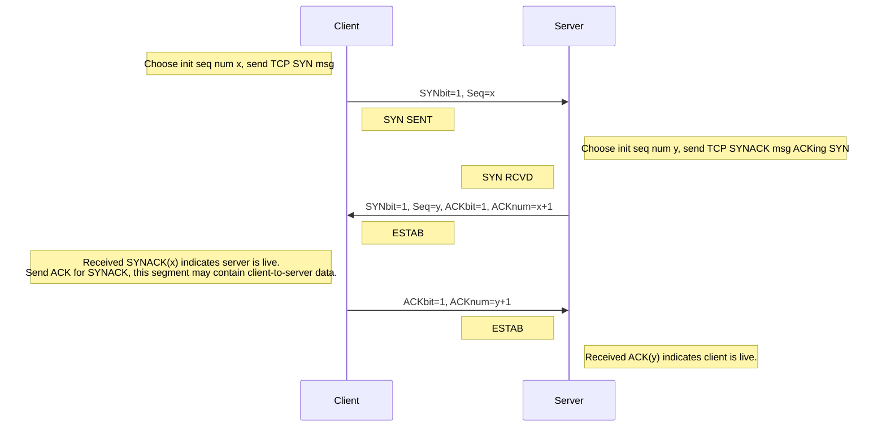
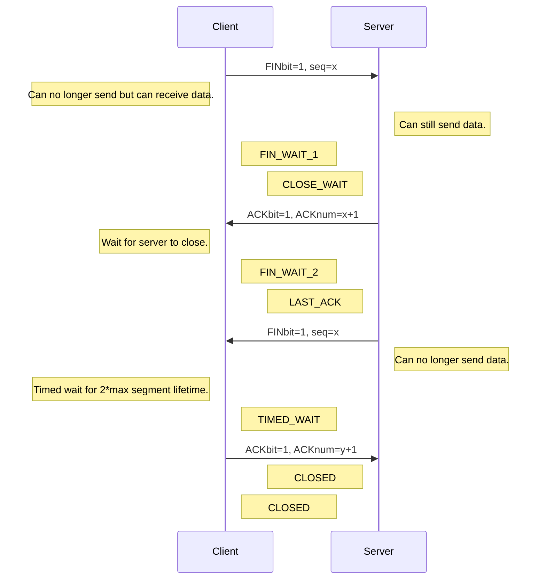

These notes are low-effort, due to catching up in this module. See [the videos and slides](https://liverpool.instructure.com/courses/54299/pages/3-transport-layer?module_item_id=1178720) for more detail.
{:.warning}

## TCP Flow Control
This is where the receiver sends messages to the sender to slow the rate of transfer. This is so that the incoming data doesn't overflow the buffer by sending data quicker than it can be processed.

* Free space is advertised in the `rwnd` field of the TCP header.
* `RcvBuffer` is set by the socket options (typically 4096 bytes).
	* Many operating systems auto adjust `RcvBuffer`.
	
	```mermaid
	flowchart
	subgraph RcvBuffer
	us[Used Space]
	rwnd["rwnd (Free Space)"]
	end
	p[TCP Segment Payloads] --> RcvBuffer
	RcvBuffer --> a[Application Process]
	```

* Sender limits the amount of unACKed data to received `rwnd`.

	This guarantees the receive buffer will not overflow.
	{:.info}

## TCP Connection Management
Before exchanging data the sender and receiver need to handshake. This includes:

* Accepting the incoming connection.
* Agreeing on connection parameters.

### Two-Way Handshake
A 2-way handshake is problematic as is gives issues when used over an unreliable medium. Ordinarily it would work like so over a port number $x$:



This can produce half-open connections and duplicate data if the handshake messages are lost and re-transmitted.
{:.warning}

### Three-Way Handshake
This is a more redundant handshake method than resolved the issue of a two way handshake:



### Closing a TCP Connection

1. Client and server each close their side of the connection:
	* Send TCP segment with `FIN` bit = 1
1. Respond to received `FIN` with `ACK`.
	* On receiving `FIN`, `ACK` can be combined with on `FIN`.

Simultaneous `FIN` exchanges can be handled.
{:.info}

