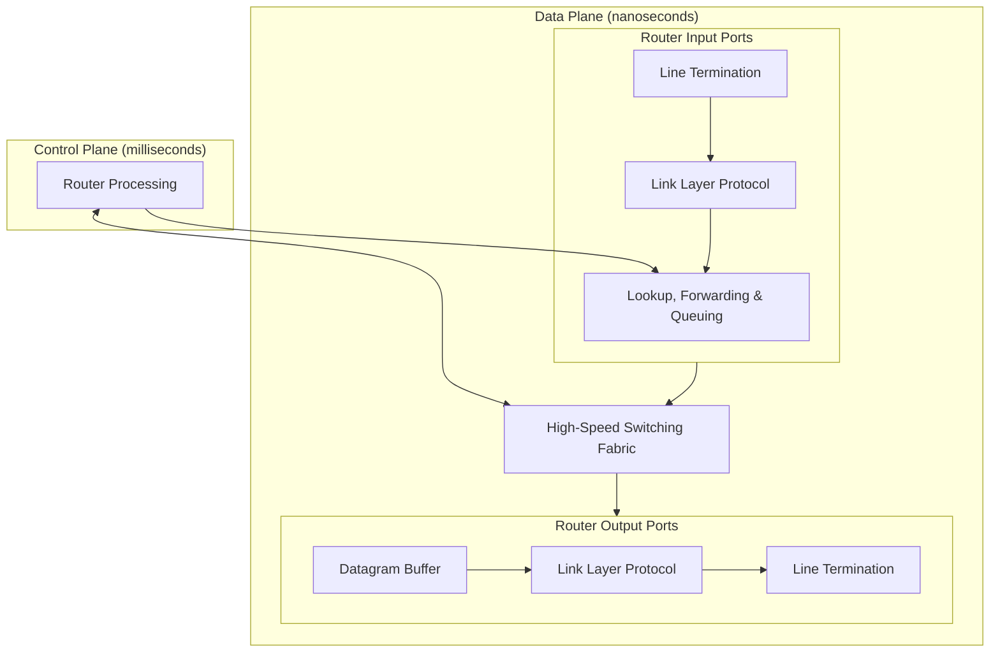
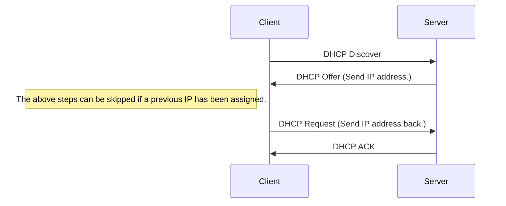

These notes are low-effort, due to catching up in this module. See [the videos and slides](https://liverpool.instructure.com/courses/54299/pages/4-network-layer-data-plane?module_item_id=1178721) for more detail.
{:.warning}

## Network Layer
The network layer completes two functions:

* Forwarding - Moving packets from a router's input link to the appropriate router output link.
* Routing - Determining the route taken by packets from source to destination.

### Data Plane
This is a **local**, per-router, function. It determines how a datagram arriving on a routers input port is forwarded to the router output port.

### Control Plane
This is a **network wide** logic. It determines how data is routed across the network.

#### Per-Router Control Plane
This in an **individual** routing algorithm that is implemented in each router to interact in the control plane:

* Each router has a table that is can use to forward packets towards its detonation.
* The tables are generated by a **distributed** algorithm, running on the routers.

#### Software-Defined Networking (SDN) Control Plane
A **remote** controller computes and installs forwarding tables in routers.

## Routers
Routers generally have the following structure:



The ports are structured as follows:

* **Line Termination** - Physical layer.
* **Link Layer** - Ethernet.
* **Lookup, Forwarding & Queuing** - Decentralised switching using the header field values to lookup the output port using a forwarding table.
	* This should be completed at line speed.
	* Input port queuing can be used if datagrams arrive faster than forwarding rate into the switch fabric.
	* **Head of the line** (HOL) blocking - A datagram at the front of the queue prevents others in the queue from moving forward.
		* If too many packets are buffered then they can be dropped and lost.
	
### Longest Prefix Matching
When looking for forwarding table entry for a given destination address, use the **longest address prefix** that matches the destination address.

| Destination Address Range | Link Interface |
| :-- | --: |
| 10.24.0.0/16 | 0 |
| 10.24.0.0/24 | 1 |
| 16.2.0.0/20 | 2 |
| Otherwise | 3 |

* 10.24.0.2 would go on interface 1 as it matches more of 10.24.0.0/24 than 10.24.0.0/16. 

The number after the slash is the number of bits that define the subnet.
{:.info}

### Switching Fabrics
You can switch using the following topologies:

* Switching Via Memory - The packet is copied to the system memory and then the output port.
	* This crosses the system bus twice.
	* Limited by the memory bandwidth.
* Switching Via Bus - The input port memory is connected directly to the output port memory.
	* Switching speed limited by bus bandwidth.
	* One packet can be on the bus at a time.
* Switching Via Interconnection Network - A grid of switched interconnects are used that can be used to reduce contention between the input ports.
	* You can use multiple stages of switches to send multiple packets at once.

## Internet Protocol (IP)
### Datagram Format
The **IPv4** datagram is laid out like so:


#### Fragmentation
The link layer can have a **maximum transfer unit** (MTU). As a result, the network layer, IP datagram must be fragmented into several that must be reassembled at the destination.

For example, with an MTU of 1500 bytes the following datagram:

| Length | ID | FragFlag | Offset |
| :-: | :-: | :-: | :-: |
| 4000 | x | 0 | 0 |

Would be split into the following fragments:

| Length | ID | FragFlag | Offset |
| :-: | :-: | :-: | :-: |
| 1500 | x | 1 | 0 |

| Length | ID | FragFlag | Offset |
| :-: | :-: | :-: | :-: |
| 1500 | x | 1 | 185 |

| Length | ID | FragFlag | Offset |
| :-: | :-: | :-: | :-: |
| 1040 | x | 0 | 370 |

Each fragment has it's own 20 byte header, which means that the total data transferred in this example is 40 bytes more than using a single datagram.
{:.info}

The offset is the number of bytes offset divided by 8. This means the data can only be fragmented every 8 bytes.
{:.warning}

### Addressing
Each network interface has an assigned IP address.

* Subnets
	* Subnets are a group of devices that can access each-other without passing through a router.
	* Devices in the same subnet have the same high-order bits.
	* Subnet Mask - Defines the number of bits that make up the subnet part of the IP address: **192.168.0**.1/24.
	
#### CIDR
Classless inter-domain routing is a method of defining the subnet and host part of an IP address:

$$
\underbrace{11001000\ 00010111\ 0001000}_\text{subnet part}\underbrace{0\ 00000000}_\text{hostname part}\\
$$

$$
200.23.16.0/23
$$

### DHCP
There are two ways of getting an IP address on a network:

* Setting a non-conflicting IP address manually.
* Dynamic host configuration protocol from a server on the network you are connecting to.
	* Allows for reuse of inactive addresses.
	* Can renew a lease on address in use.



You can send broadcast traffic on a network by sending to 255.255.255.255. Port 67 is used for DHCP.
{:.info}

All of this is done as broadcast so multiple DHCP servers on the same network know what IP addresses are used.
{:.info}

DHCP can also offer the following:

* Address of first-hop router.
* Name and IP address of DNS server.
* Network mask.

### Network Address Translation
All device in a local network share just one IPv4 address as far as the outside world is concerned.

```plantuml
nwdiag {
network ISP {
Modem [address = "138.76.29.7"];
}
network Local {
address = "10.0.0.0/24"
Modem [address = "10.0.0.1"];
Device1 [address = "10.0.0.2"];
Device2 [address = "10.0.0.3"];
Device3 [address = "10.0.0.4"];
}
```

* All datagrams **leaving** have the same source NAT IP (138.76.29.7) but different source port numbers.
* Datagrams with source or destination in the "Local" network have a 10.0.0.0/24 address for the source or destination (as usual).
* Devices in the local network can only have the following local prefixes:
	* 10/8
	* 172.16/12
	* 192.168/16

This works on the router in the following sequence:

1. Host 10.0.0.2 sends datagram to 128.119.40.186:80.
1. NAT router changes datagram source address from 10.0.0.2:3345 to 138.76.29.7:5001 and notes this in the table.
1. Reply arrives from the destination with address of 138.76.29.7:5001. 
1. The port is looked up in the table and is forwarded to the correct client on the local network.

### IPv6
IPv4 only used a 32-bit addresses. IPv6 allows for every device to have it's own unique address on the internet using a 128-bit address. The datagram is laid out like so:


* No checksum (to speed processing as routers)
* No fragmentation or reassembly
* No options

#### Tunnelling & Encapsulation
To send an IPv6 datagram through a router that only supports IPv4 it must be **encapsulated** inside an IPv4 packet.

* Routers at the edge of the tunnel should be configured to pack and unpack the IPv6 datagrams.

This is slower through the legacy tunnel but is quicker through the rest of the network.
{:.info}

## Generalised Forwarding & SDN
Each router contains a forwarding table (flow table). When a packet arrives we complete a **match plus action**:

* Match bits in arriving packet and take action.

Simple routers use **destination based forwarding** where packets are forwarded based on the destination IP address. 

**Generalised forwarding** includes the following features:

* Many IP header fields can determine actions.
* Additional actions are possible including: drop, copy, modify, log.

### Match & Action
The flow of packets is enabled by **flow tables** like so:

| match | action |
| :-: | :-: |
| | |

Generalised forwarding can use the following in it's packet handling:

* Match - Pattern values in packet header fields.
* Actions _ For matched packet such as: drop, forward, modify, send to controller.
* Priority - Disambiguate overlapping patterns.
* Counters - Number of bytes and number of packets.

This can be useful for dropping or investigating malicious traffic.
{:.info}

### OpenFlow
OpenFlow tables can complete generalised forwarding using headers in the:

* Link Layer (MAC, Ethernet, VLANs)
* Network Layer (IP)
* Transport Layer (TCP/UDP)

The tables are laid out like so: 

| Switch Port | MAC src | MAC dst | Eth type | VLAN ID | VLAN Pri | IP Src | IP Dst | IP Prot | IP TOS | TCP s-port | TCP dport | Action |
| :-: | :-: | :-: | :-: | :-: | :-: | :-: | :-: | :-: | :-: | :-: | :-: | :-: |
| * | * | * | * | * | * | * | * | * | * | * | 22 | drop |

Drop all traffic on port 22 (SSH).
{:.info}

You can then use these tables to complete the following actions:

* Router
	* Match - Longest destination IP prefix.
	* Action - Forward out a link.
* Firewall
	* Match - IP addresses and TCP/UDP port numbers.
	* Action - Permit or deny.
* Switch
	* Match - Destination MAC address
	* Action - Forward or flood (broadcast).
* NAT
	* Match - IP address and port.
	* Action - Rewrite address and port.
	
**Orchestrated tables** can create network-wide behaviour by connecting a set of routers to an OpenFlow server.