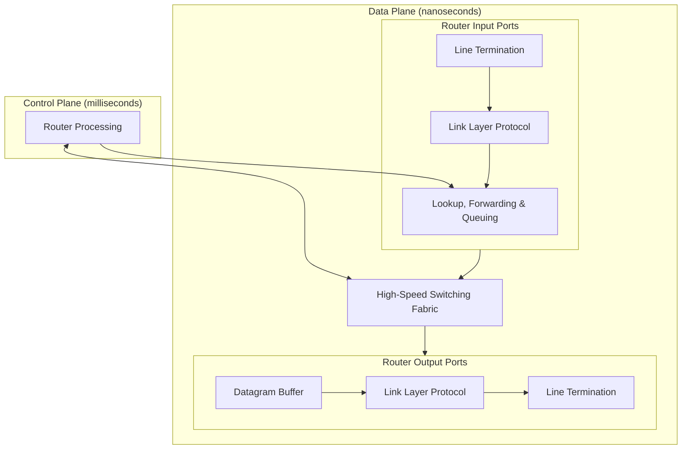

These notes are low-effort, due to catching up in this module. See [the videos and slides](https://liverpool.instructure.com/courses/54299/pages/4-network-layer-data-plane?module_item_id=1178721) for more detail.
{:.warning}

## Network Layer
The network layer completes two functions:

* Forwarding - Moving packets from a router's input link to the appropriate router output link.
* Routing - Determining the route taken by packets from source to destination.

### Data Plane
This is a **local**, per-router, function. It determines how a datagram arriving on a routers input port is forwarded to the router output port.

### Control Plane
This is a **network wide** logic. It determines how data is routed across the network.

#### Per-Router Control Plane
This in an **individual** routing algorithm that is implemented in each router to interact in the control plane:

* Each router has a table that is can use to forward packets towards its detonation.
* The tables are generated by a **distributed** algorithm, running on the routers.

#### Software-Defined Networking (SDN) Control Plane
A **remote** controller computes and installs forwarding tables in routers.

## Routers
Routers generally have the following structure:

The ports are structured as follows:

* **Line Termination** - Physical layer.
* **Link Layer** - Ethernet.
* **Lookup, Forwarding & Queuing** - Decentralised switching using the header field values to lookup the output port using a forwarding table.
	* This should be completed at line speed.
	* Input port queuing can be used if datagrams arrive faster than forwarding rate into the switch fabric.
	* **Head of the line** (HOL) blocking - A datagram at the front of the queue prevents others in the queue from moving forward.
		* If too many packets are buffered then they can be dropped and lost.
	
### Longest Prefix Matching
When looking for forwarding table entry for a given destination address, use the **longest address prefix** that matches the destination address.

| Destination Address Range | Link Interface |
| :-- | --: |
| 10.24.0.0/16 | 0 |
| 10.24.0.0/8 | 1 |
| 16.2.0.0/12 | 2 |
| Otherwise | 3 |

* 10.24.0.2 would go on interface 1 as it matches more of 10.24.0.0/8 than 10.24.0.0/16. 

The number after the slash is the number of bits from the end of the IP address that can be changed.
{:.info}

### Switching Fabrics
You can switch using the following topologies:

* Switching Via Memory - The packet is copied to the system memory and then the output port.
	* This crosses the system bus twice.
	* Limited by the memory bandwidth.
* Switching Via Bus - The input port memory is connected directly to the output port memory.
	* Switching speed limited by bus bandwidth.
	* One packet can be on the bus at a time.
* Switching Via Interconnection Network - A grid of switched interconnects are used that can be used to reduce contention between the input ports.
	* You can use multiple stages of switches to send multiple packets at once.

## Internet Protocol (IP)
### Datagram Format
### Addressing
### Network Address Translation
### IPv6
## Generalised Forwarding & SDN
### Match & Action
### OpenFlow