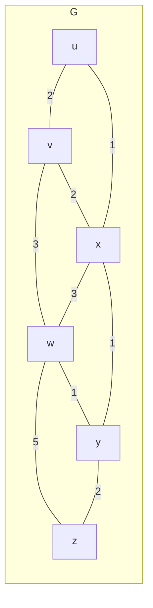

These notes are low-effort, due to catching up in this module. See [the videos and slides](https://liverpool.instructure.com/courses/54299/pages/5-network-layer-control-plane?module_item_id=1178722) for more detail.
{:.warning}

## Routing Algorithms
Routing algorithms choose a sequence of routers for a packet to traverse from source to destination.

We can define the cost of a hop by using link costs:



This graph can be represented as:

$$
G=(N,E)
$$

Where $N$ is the set of routers:

$$
\{u,v,w,x,y,z\}
$$

and $E$ is the set of links:

$$
\{(u,v),(u,x),(v,x),(v,w),(x,w),(x,y),(w,y),(w,z),(y,z)\}
$$

### Classifying Routing Algorithms
Algorithms can have some the following conflicting classifications:

* Global - All routers have complete topology and link cost info.
	* Link state algorithms.
	
	*or*
* Decentralised - Iterative process of computation using an exchange of info with neighbours.
	* Routers initially only know link costs to attached neighbours.
	* Distance vector algorithms.


* Static - Routes change slowly over time.

	*or*
* Dynamic - Routes change more quickly.

## Intra-AS Routing (OSPF)

In this scenario you want a routing algorithm that has the best performance.
{:.info}

**Autonomous systems** (AS) are a single domain:

* All router in an AS must run the same intra-domain protocol.
* Routers in different AS may run any protocol
* **Gateway routers** link the edge of an AS to the gateways of other ASs.

Common intra-AS routing protocols are: RIP, EIDRIP, OSPF (essentially identical to IS-IS).

### OSPF (Open Shortest Path First) Routing
This is a common and open intra-AS routing protocol. 

This is a classic link-state protocol:

1. Each router floods OSPF link-state advertisements (directly over IP rather than using TCP/UDP) to all other routers in the entire AS.
1. Multiple link costs metrics possible:
	* Bandwidth
	* Delay
1. Each router has a full topology, uses Dijkstra's algorithm to compute the forwarding table.

All OSPF messages are authenticated to prevent malicious intrusion.
{:.info}

#### Hierarchical OSPF
This allows for a two-level hierarchy with a:

* Backbone
	* Localised around boundary routers.
* Local Area
	* Include one router from the backbone and a section of the internal network.

```plantuml
nwdiag {
	group a {
		color = "pink" 
		b1
		a11
		a12
		a13
	}
	group b {
		color = "lightblue"
		b2
		a21
		a22
		a23
	}
	group c {
		color = "lightgreen"
		b3
		a31
		a32
		a33
	}
	internet -- boundary
	network backbone {
	boundary
		b1
		b2
		b3
	}
	network area1 {
		b1
		a11
		a12
		a13
	}
	network area2 {
		b2
		a21
		a22
		a23
	}
	network area3 {
		b3
		a31
		a32
		a33
	}
}
```

Link state advertisements are flooded only in an area or the backbone. This limits traffic on large networks:

* Each node has a detailed area topology. It only knows the direction to reach other destinations.

## Inter-AS Routing (BGP)

In this scenario policy is more important than performance as the data is not internal. 
{:.info}

Boarder gateway protocol (BGP) is the de-facto standard inter-domain routing protocol. BGP provides each AS a means to:

* eBGP - Obtain subnet reachability information from neighbouring ASes.
* iBGP - Propagate reachability information to all AS-internal routers.
* Determine *good* routes to other networks based on reachability information and **policy**.


```plantuml
nwdiag {
	group {
		1a
		1b
		1c
		1d
	}
	group {
		2a
		2b
		2c
		2d
	}
	group {
		3a
		3b
		3c
		3d
	}
	network peering1 {
		address = "eBGP"
		color = "pink"
		1c
		2a
	}
	network peering2{
		address = "eBGP"
		color = "pink"
		2c
		3a
	}
	network AS1 {
		address = "iBGP"
		color = "lightblue"
		1a
		1b
		1c
		1d
	}
	network AS2 {
		address = "iBGP"
		color = "lightblue"
		2a
		2b
		2c
		2d
	}
	network AS3 {
		address = "iBGP"
		color = "lightblue"
		3a
		3b
		3c
		3d
	}
}
```

Local routers run iBGP and gateway routers run both iBGP and eBGP.
{:.info}

### BGP Paths
If an AS advertises a path to another AS then it promises that it can forward datagrams to that AS.

A BGP advertised routes contains two parts:

* Prefix - Destination being advertised.
* Attributes
	* `AS-PATH` - List of ASes through which prefix advertisement has passed.
	* `NEXT-HOP` - Indicates specific internal-AS router to next to next-hop AS.
	
You can also have policy-based routing:

* Gateway receiving route advertisement uses its own **import policy** to decide whether to accept or decline an incoming path. 
	* Never route through AS$x$.
* AS policy also determines whether to advertise a path to other neighbouring ASes.

### BGP Route Selection
A router may learn about more than one route to a destination AS. It will select a route based on:

1. Local preference value attribute (policy decision).
1. Shortest `AS-PATH`.
1. Closest `NEXT-HOP` router (hot potato routing).
1. Additional criteria.

## SDN Control Plane
This aims to put less control with proprietary routers, concerning the routing tables, and instead put that load on centralised controllers. This can provide:

* Easier network management.
* Table based forwarding and programming routers with routing tables (OpenFlow).
* Open implementations of the control plane can be used.
* Traffic routing is easier.

### Implementation
SDN uses the following hardware:

* Fast, simple switches that have support for communicating with a controller.
* SDN controller that has the following components:
	* Interface layer to network control apps (abstractions API).
	* Network-wide state management that holds the state of networks links, switches, services on a distributed database.
	* Communication between the SDN controller and the controlled switched.
	* Can be implemented as a distributed system for performance and stability.

The SDN applications can be **unbundled**, in that they are distinct from the routing vendor or SDN controller.
{:.info}

#### OpenFlow Protocol

* Operates between the controller and the switch.
* TCP is used to exchange messages with optional encryption.

There are three classes of OpenFlow messages:

* Controller to switch.
* Asynchronous messages from the switch to the controller.
	* A link has broken or a suspect packet is received.
* Symmetric messages from the switch to the controller.
	* To check liveness.