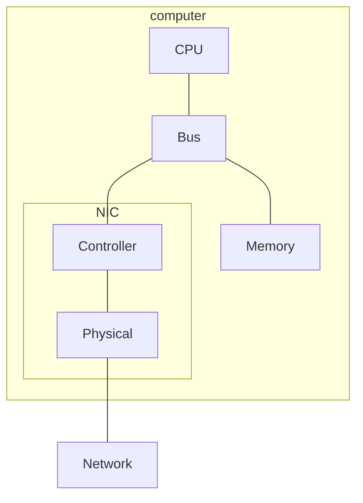

These notes are low-effort, due to catching up in this module. See [the videos and slides](https://liverpool.instructure.com/courses/54299/pages/6-link-layer?module_item_id=1178723) for more detail.
{:.warning}

The **link layer** concerns the links that connect various nodes (hosts and routers) on a network. The link layer only needs to transfer a frame from a node to an **adjacent node**.

## Services
The link layer provides the following **services**:

* Datagram encapsulated in **frames** with a header and trailer.
* Channel access for shared mediums.
* **MAC addresses** in frame headers identify source and destination.
* Reliable delivery between **adjacent nodes**:
	* Used on links with high error rates.
* Flow Control
* Error Detection
* Error Correction
	* The receiver corrects errors **without re-transmission**.

## Hardware Implementation
The link layer is implemented in the network interface. This can be:

* NIC (Network Interface Card)
* Built-in network cards.

Network interfaces also implement the physical layer too as they physically connect to the network.
{:.info}

## Error Detection
Error detection isn't always 100% reliable:

* Larger check-sums yield better detection and correction

### Parity Checking
**Single bit parity** can detect single bit errors:

| $d$ Data Bits | Parity Bit |
| --: | :-- |
| 0111101001010010111101 | 1 |

**Two dimensional bit parity** can detect **and correct** single bit errors:

| $d_{1,1}$ | $\ldots$ |  $d_{1,j}$ | $d_{1,j+1}$ |
| :-: | :-: | :-: | :-: |
| $d_{2,1}$ | $\ldots$ |  $d_{2,j}$ | $d_{2,j+1}$ |
| $\ldots$ | $\ldots$ | $\ldots$ | $\ldots$ |
| $d_{i,1}$ | $\ldots$ |  $d_{i,j}$ | $d_{i,j+1}$ |
| $d_{i+1,1}$ | $\ldots$ |  $d_{i+1,j}$ | $d_{i+1,j+1}$ |

* The right most column and bottom row are the parity bits.
* The parity of a row or column is the single bit sum of that row or column.
* The bottom right parity digit can be used as singe bit parity for the parity bits.

### Cyclic Redundancy Check (CRC)
This is a more powerful error-detection coding:

* $D$ - Data bits given as a binary number.
* $G$ - Bit pattern (generator), or $r+1$ bits.
	
	One bit longer than the number of CRC bits.
	{:.info}

We need to choose $r$ CRC bits, $R$ such that $<D,R>$ exactly divisible by $G$ (mod 2):

* Receiver knows $G$, divides $<D,G>$ by $G$. If non-zero remainder then an error is detected.
* Can detect all burst errors less than $r+1$ bits.

This method is used in Ethernet and WiFi.
{:.info}

#### CRC Example
Before we divide by the generator $G$ we shift the data $D$ to the left by $r$ bits, or the length of the generator - 1:

$$
R = \text{remainder}[\frac{D\cdot2^r}{G}]
$$

To calculate this we do modulo 2 division on data using the generator completing an XOR in each step:

## Multiple Access Protocols
**Broadcast links** are a shared link such as WiFi. If two or nodes transmit at the same time then there is **interference**:

* **Collision** - If a node receives two or more signals at the same time.

Ideally, multiple access protocols are **distributed algorithms** that have the following properties:

* Determine how nodes share the channel.
	* Determine when nodes can transmit.
* Communication about channel sharing must use the channel.
	* No out of band channel coordination is allowed.
* When one node wants to transmit, it can do so at the line speed.
* When multiple nodes transmit, they can do so at an equal divisor of the line speed.
* Fully decentralised:
	* No special nodes.
	* No synchronisation of clocks.

There are three **broad classes** of multiple access channel protocols:

* **Channel Partitioning**
	* Divide channel into smaller pieces (time, frequency, code).
	* Allocate piece to node for exclusive use.
* **Random Access**
	* Channel not divided, allowing collisions.
	* Recover from collisions.
* **Taking Turns** 
	* Nodes take turns, but nodes with more to send can take longer turns.
	
### Time Division Multiple Access (TDMA)

* Access to channel in rounds.
* Each station gets a fixed length slot (length = packet transmission time) in each round.
* Unused slots go idle.

### Frequency Division Multiple Access (FDMA)

* Channel spectrum divided nto frequency bands.
* Each station assigned fixed frequency bands.
* Unused transmission time in frequency bands go idle.

### Random Access Protocols
#### Slotted ALOHA
Slotted ALOHA has the following **assumptions**:

* All frames are the same size.
* Time is divided into equal size slots (time to transmit 1 frame).
* Nodes start to transmit only slot beginning.
* Nodes are synchronised.
* If 2 or more nodes transmit in slot, all nodes detect collision.

It operates like so:

1. When node obtains fresh frame transmit in the next slot.
	* If **no collision** - Node can send new frame in next slot.
	* If **collision** - Node re-transmits frame in each subsequent slot with probability $p$ until success.
	
		Randomisation is included such that different nodes don't re-transmit at the same time.
		{:.info}

#### Carrier Sense Multiple Access (CSMA)
The **simple implementation** listens before transmit:

* If channel is sensed idle - Transmit entire frame.
* If channel sensed busy - Defer transmission.

**Collision detection** (CSMA/CD) is implemented like so:

* Collisions detected within short time.
* Colliding transmissions aborted, reducing channel wastage.
	* You can abort before the whole frame is transmitted.
* Collision detection is difficult in wireless when you can't listen to the entire broadcast area or you transmit and receive on the same areal.

Propagation delay can cause collisions, as you can start transmitting before you have heard an existing transmission.
{:.warning}

##### Ethernet CSMA/CD Algorithm

1. NIC receives datagram from network layer, creates frame.
1. If NIC senses channel:
	* If idle - Start frame transmission.
	* If busy - Wait until channel idle, then re-transmit.
1. If NIC transmits entire frame without collision, NIC is done with fram.
1. If NIC detects another transmission while sending - Abort send and send jam signal.
1. After aborting, NIC enters **binary exponential backoff**:
	* After $m^\text{th}$ collision, NIC chooses $K$ at random, from $\\{0,1,2,\ldots,2^{m-1}\\}$. NIC waits $K\times512$ bit times, returns to step 2.
	* More collisions result in higher backoff interval.
	
### Taking Turns Protocols
#### Polling

* Master node invites other nodes to transmit in turn.
* Typically used with dumb devices.

This method can the following issues:

* Polling Overhead
* Latency
* Single point of failure.

#### Token Passing

* Control **token** passed from one node to the next sequentially.
* Node with token can transmit.

This method can the following issues:

* Token Overhead
* Latency
* Single point of failure (token)

## LANs
### Addressing & ARP
### Ethernet
### Switches
## Wireless Links & WLAN
