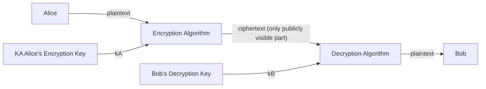

## Types of Attacks
There are two general classes of network attacks:

* Passive Attack
	
	Hard to detect.
	{:.info}
	* Eavesdropping - Packet sniffing.
	* Impersonation - Spoofing source addresses.
* Active Attacks
	* Man-in-the-Middle Attacks - Actively changing messages on the connection.
	* Hijacking - Taking over an existing connection.
	* Denial of Service - Overloading resources.
	
## Types of Network Security

* Confidentiality through encryption.
* Authentication
* Message Integrity
* Access & Availability

## Cryptography Notation

In this system we use the following notation:

* $m$ - Plaintext Message.
* $K_A(m)$ - Ciphertext, encrypted with $K_A$

	$$
	m=K_B(K_A(m))
	$$