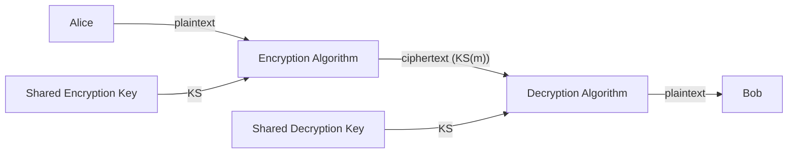
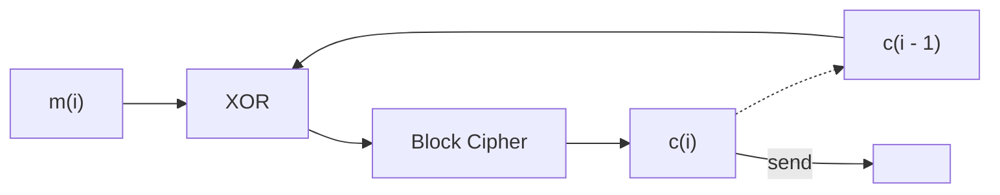

In symmetric key cryptography both parties share the same key:

## Symmetric Ciphers
The following are examples of symmetric ciphers:

* **Caesar Cipher** (ROT13)
	* All letters in the alphabet are rotated.
	* Only 26 keys.
* **Monoalphabetic Cipher**
	* Letters are substituted for other letters in any order.
	* 26! combinations.
	* Can be cracked using statistical/lexical analysis.
* **Polyalphabetic Encryption**
	* There is a set of $n$ substitution ciphers: $M_1,M_2,\ldots,M_n$.
	* They are used in a cycling pattern (like enigma).
	
	The encryption key for this encryption are the $n$ substitution ciphers and the cyclic pattern.
	{:.info}

### Block Ciphers
The message to be encrypted is processed in **blocks** of $k$ bits:

* A 1 to 1 **mapping** is used to map $k$-bit block of plaintext to $k$-bit block of ciphertext.
* For a mapping of $k=n$ there are $2^k!$ mappings.

| Input | Output |
| :-- | :-- |
| 000 | 110 | 
| 001 | 111 |
| 010 | 101 |
| 011 | 100 | 
| 100 | 011 | 
| 101 | 010 |
| 110 | 000 |
| 111 | 001 |

The longer the **block size** the more secure the cipher is.
{:.info}

There are **too many mappings** to be held in memory for a 64 bit block length. As a result we:

1. **Split** the input into 8 bit blocks.
1. **Encrypt** the 8 bit blocks as above.
1. **Shuffle** the 8 bit blocks to produce the final 64 bit output.
1. **Loop** for $n$ rounds.
	* Changing a single bit in the input changes more in the output.
	
#### Cipher Block Chaining
When encrypting large messages, if two 64 bit blocks contain the same data they will produce the same output. This can allow for analytical description, which we don't want.

**Cipher block chaining** XORs the $i^{\text{th}}$ input block, $m(i)$, with previous block of cipher text $c(i-1)$:

* The first block to be sent is the **initialisation vector** $c(0)$, which is just a random number in plaintext.

#### DES (Data Encryption Standard)

* 56 bit Symmetric Key
* 64 bit Plaintext Input
* Block cipher with block chaining.

This can be decrypted with brute force in less than a day.
{:.error}

* Can be made more secure with 3DES (encrypting 3 times).
	* Only increases brute force time linearly.

#### AES (Advances Encryption Standard

* Processes data in 128 bit blocks.
* 128, 192 or 256 bit keys.

Brute force attacks would take 149 trillion years, due to the large key-space.
{:.info}