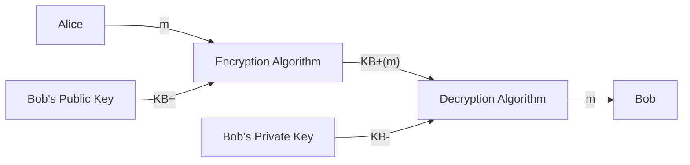

This method has two keys:

* Public key:
	* Known to all.
	* Used for encryption.
* Private key:
	* Only known to the receiver.
	* Used for description.

The following notation is used:

* $K^+_B$ - Bob's Public Key
* $K^-_B$ - Bob's Private Key
* $K^+_B(m)$ - Ciphertext

The plaintext is decrypted by completing the following operation:

$$
m = K^-_B(K^+_B(m))
$$

## Requirements
For public key cryptography to work you need the following:

* $K^-_B(\cdot)$ and $K^+_B(\cdot)$ such that:

	$$
	m = K^-_B(K^+_B(m))
	$$
* Given a public key $K^+_B$, it should be computationally infeasible to determine the private key $K^-_B$.

### Modular Arithmetic
$x\mod n=$ remainder of $x$ when we divide by $n$. This has the following properties:

$$
((a\mod n) + (b\mod n))\bmod n = (a+b)\bmod n\\
((a\mod n) - (b\mod n))\bmod n = (a-b)\bmod n\\
((a\mod n) \times (b\mod n))\bmod n = (a\times b)\bmod n
$$

Therefore:

$$
(a\mod n)^d\bmod n =a^d \bmod n
$$

## RSA (Rivest, Shamir, Adelson Algorithm)
We consider that the **message** can be expressed as a bit pattern that can be converted to a decimal number.

### Creating Public/Private Key Pair

1. Choose two large prime numbers $p,q$ (could be 1024 bits each).
1. Compute $n=pq,z=(p-1)(q-1)$.
1. Choose $e$ (with $e<n$) that has no common factors with $z$. 
	
	$e,z$ are relatively prime.
	{:.info}
	
	Prime factor decomposition can be useful so that you avoid those primes.
	{:.info}
1. Choose $d$ such that $ed-1$ is exactly divisible by $z$.
	
	This is the same as $ed\bmod z=1$.
	{:.info}
1. The **public key** is $(n,e)$ and the **private key** is $(n,d)$.

### Encryption & Decryption
Given $(n,e)$ and $(n,d)$ as computed above:

1. To encrypt message $m$ ($<n$), compute:

	$$
	c = m^e\bmod n
	$$
1. To decrypt the received bit pattern, $c$, compute:

	$$
	m = c^d\mod n
	$$
	
Therefore:

$$
m = (\underbrace{m^e\bmod n}_c)^d\bmod n
$$

### RSA Proof
We must show that $c^d\bmod n=m$ and $c=m^e\bmod n$.

We can use the fact that for any $x$ and $y$:

$$
x^y\bmod n = x^{(y\mod z)}\bmod n
$$

where $n=pq$ and $z=(p-1)(q-1)$.

Therefore:

$$
\begin{aligned}
c^d\bmod n&=(m^e\bmod n)^d\bmod n\\
&= m^{ed}\bmod n\\
&= m^{(ed\mod z)}\bmod n\\
&= m^1\bmod n\\
&= n
\end{aligned}
$$

There is also an additional property of RSA that we can prove:

$$
K^-_B(K^+_B(m))=m=K^+_B(K^-_B(m))
$$

Using the public key and then the private key is the **same** as using the keys the **other way around**.
{:.info}

This can be proved like so:

$$
\begin{aligned}
(m^e\bmod n)^d \bmod n &= m^{ed} \bmod n\\
&= m^{de} \bmod n\\
&= (m^d\bmod n)^e \bmod n
\end{aligned}
$$

### Session Keys
DES is at least 100 times faster than RSA, therefore we:

1. Use public key cryptography to establish a secure connection.
1. Establish a second **symmetric session key** ($K_S$) for encrypting data.