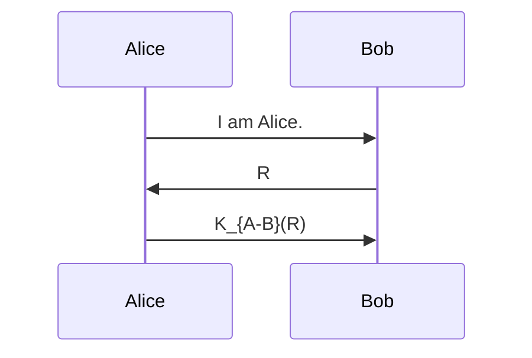
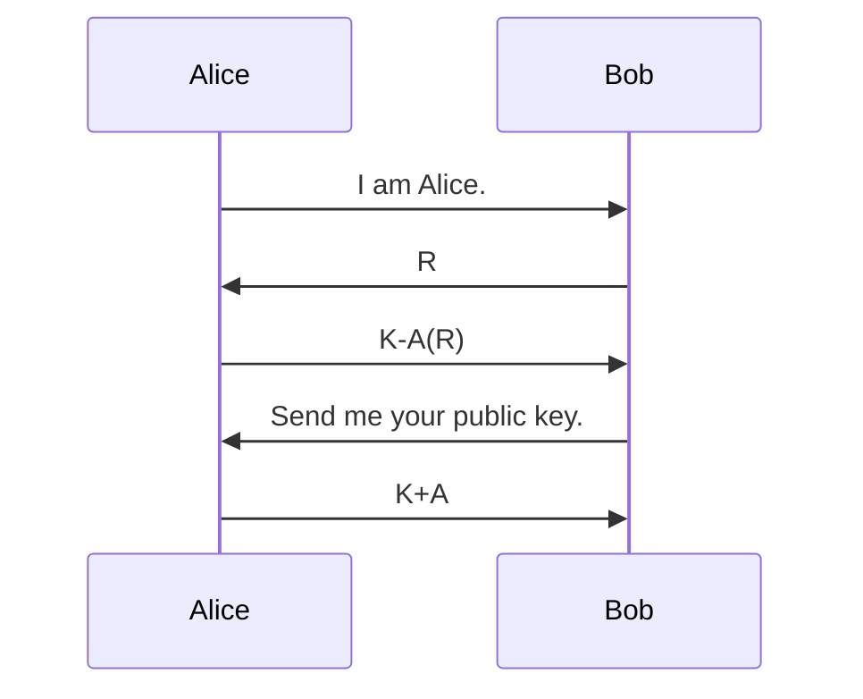

In order for authentication to be secure you need to ensure that the protocol avoids **replay attacks**:

* This is where an attacker **replays** a recorded packet and is able to authenticate as you.

## Nonce
To avoid this the server (Bob) can send a **nonce** (number used once) $R$ which Alice can manipulate and send back:

* This avoids the issue where an attacker can replay Alice's messages as they will be different every time.

## Symmetric Key Authentication
Provided that we have a shared key with the server we can complete the following actions:

## Public Key Authentication
To complete this with public key cryptography, we can do the following:

Bob can the compute:

$$
K^+_A(K^-_A(R))=R
$$

Therefore, the message must have been encrypted with Alice's private key $K^-_A$.

### Man in the Middle Attack
If a bad actor (Trudy) poses as Alice to Bob and as Bob to Alice. They can manipulate the messages between the two parties:

* Trudy can then encrypt the message back to the server with her own private key $K^-_T$.
* Trudy can then send her public key $K^+_T$ to the server.

This can be made completely transparent to Bob and Alice.
{:.info}

Public key cryptography is only secure if the public key of a person is correct.
{:.error}