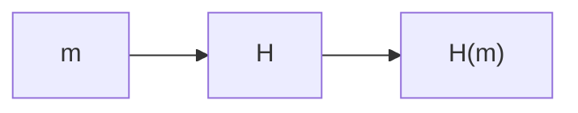
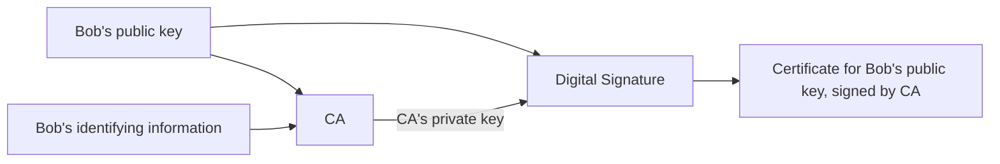
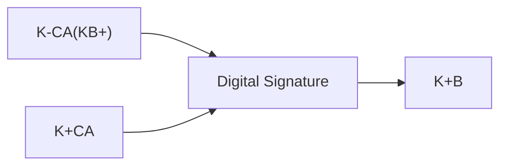

## Digital Signatures
Digital signatures should be:

* Verification of a document creator.
* Verifiable and non-forgettable.
	* Must have only been created by the document creator.

We can complete a **simple** digital signature by encrypting the document with your private key $K^-_B$.

This is computationally expensive, especially as message length gets longer.
{:.warning}

### Message Digests
This is a fixed-length, easy to compute, hash of a document:

* Apply a hash function $H$ to $m$ to get a fixed size message digest $H(m)$.



Hash functions have the following properties:

* Many to One
* Produce fixed size message digests.
* Given a hash $x$ it should be computationally infeasible to find $m$ such that $x=H(m)$.
	
	It should be infeasible to find another message with the same hash.
	{:.info}
	
#### Digital Signature with Message Digest
We can use message digests to compute the digital signature quicker for long files.

1. Bob sends a digitally signed message:
	
	```mermaid
	graph
	m[Large message m] --> H[H - Hash function] --> Hm["H(m)"] --> ds["Digital Signature"]
	K-B --> ds --> dse[Encrypted Message Digest] --> +
	m --> + --> out
	```
1. Alice verifies the signature and the integrity of the digitally signed message:
	
	```mermaid
	graph
	in --> m[Large message m] & dse[Encrypted Message Digest]
	m --> H[H - Hash function] --> Hm["H(m)"] --> =
	dse --> ds["Digital Signature"] --> Hm2["H(m)"] --> =
	K+B --> ds
	```

## Public Key Certification Authorities (CA)

This method fixes the man in the middle attack issue from using plain public key authentication.
{:.success}

* A CA binds a public key to a particular entity $E$.
* The entity registers its public key with CE and provides proof of identity to the CA:
	* The CA creates a certificate binding the identity $E$ to $E$'s public key.
	* Certificate containing $E$'s public key digitally signed by the CA.
	
### Creating Certificates



### Verifying Certificates

