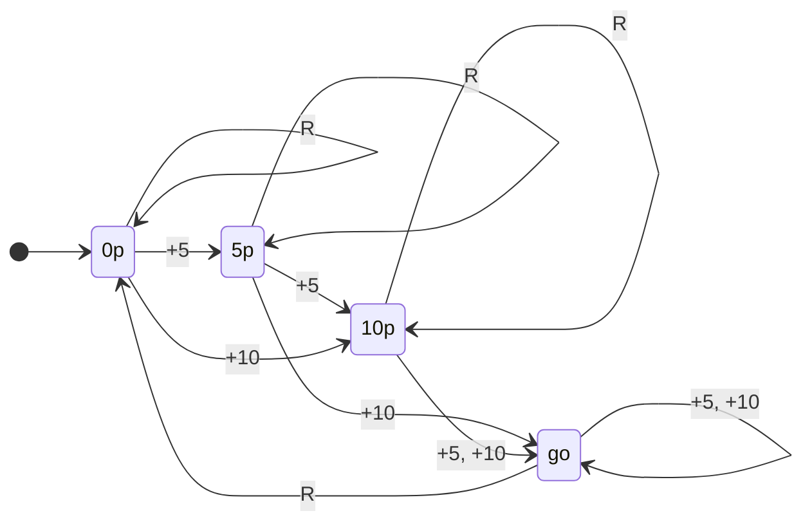
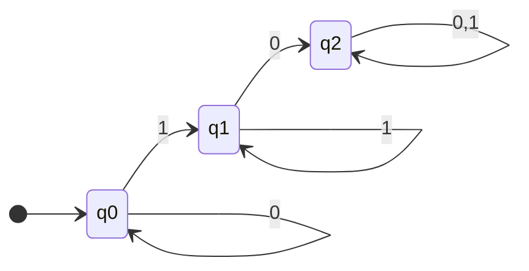
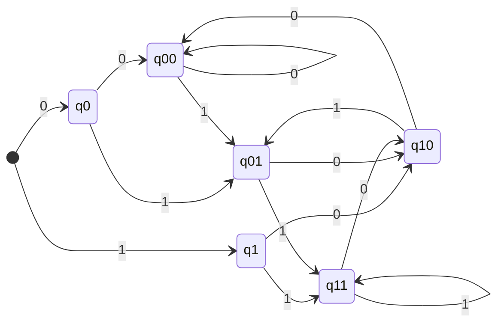

Here is an example of a finite automaton:

* There are **states** and the **start state** is $\text{0p}$.
* The automaton takes inputs from $\\{+5,+10,R\\}$.
* The state $\text{go}$ is an **accepting state**.
* There are **transitions** saying what to do for every state and every alphabet symbol.

## Defining DFAs
A finite automaton (DFA) is a 5 tuple $Q,\Sigma,\delta,q_0,F)$ where:

* $Q$ is a finite set of **states**.
* $\Sigma$ is an **alphabet**
* $\delta:Q\times\Sigma\rightarrow Q$ is a **transition function**.
* $q_0\in Q$ is the **initial state**.
* $F\subseteq Q$ is the set of **accepting states** (or **final states**).

	Accepting states should be denoted by double circles. I can only do underlined so I will do that.
	{:.info}
	
### Example

* Alphabet: $$\Sigma=\{0,1\}$$
* States: $$Q=\{q_0,q_2,q_2\}$$
* Initial State: $$q_0$$
* Accepting States: $$F=\{q_0,q_1\}$$
* Table of transition functions $\delta$:

	| States | Inputs | |
	| :-: | :-: | :-: |
	| | 0 | 1 |
	| $q_0$ | $q_0$ | $q_1$ |
	| $q_1$ | $q_2$ | $q_1$ |
	| $q_2$ | $q_2$ | $q_2$ |
	
	Generally we will just draw the state diagram and not the table.
	{:.info}

## Language of a DFA
> The **language of a DFA** ($Q,\Sigma,\delta,q_0,F$) is the set of all strings over $\Sigma$ that, starting from $q_0$ and following tha transitions as the string is read from left to right, will reach some accepting state.

This basically means that the language of a DFA is a valid path on a DFAs state diagram that ends at an accepting state.

For additional examples for DFA languages see [this video](https://liverpool.instructure.com/courses/47455/modules/items/1252637).
{:.info}

### Ends With... Example
For examples on DFAs that accept strings that **end with** ... see [this video](https://liverpool.instructure.com/courses/47455/modules/items/1252638).
{:.info}

One example given ends with the string $\\{0,1\\}$. For this you'd need the following graph:

To do this you make a tree of options up to the length of the given string and then loop back around.
