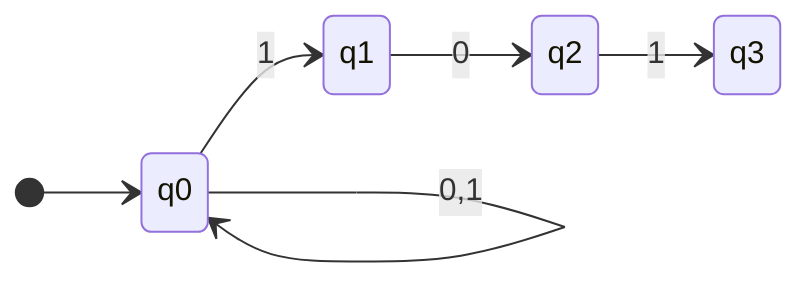
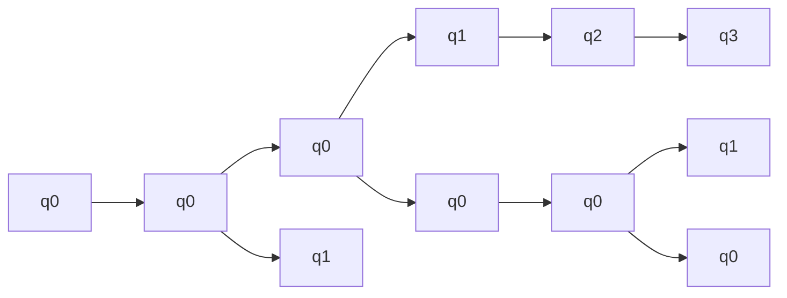
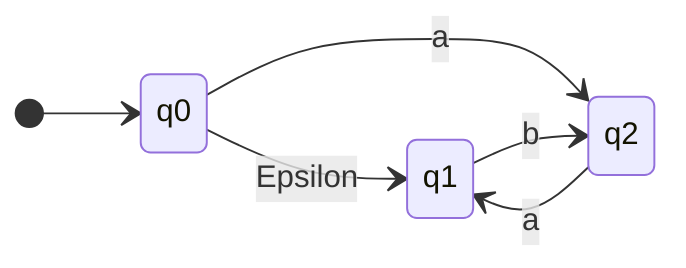
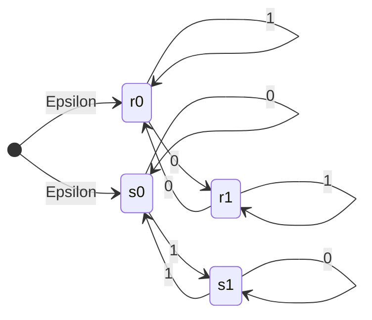

Nondeterministic finite automatons allow us to make **guesses**. This can enable abilities such as **look-ahead**. They have the following properties:

* Each state can have **zero, one, or more** outgoing transitions labelled by the **same** symbol.
* The input is accepted if **at least one** computational path accepts.

## Example
This is an automaton that accepts words that end in `101`.



This reads as:

* State $q_1$ has **no transition** labelled 1.
* Upon reading 1 in $q_1$, die; upon reading 0, continue to $q_2$.
* State $q_3$ has **no transition going out**.
* Upon reading 0 or 1 in $q_3$, die.

and performs the following actions:

1. Gess if we are three symbols away fromt he end of the input.
1. If so, guess if we will see the pattern `101`.
1. Check that we are at the end of the input.


All unlabelled paths are rejected, or go to the $q_\text{die}$ state.
{:.info}

### Running an NFA
As guessing is involved, an NFA can reach **several different states** after reading a given word.

To calculate the result we must keep track of all the possible states and then record if any states result in an **accepting state**.
{:.info}

A word is accepted by the example NFA if **at least one of the states** are final.

### Computing Procedure
In order to calculate from an NFA you can back-track through the possible states. For the input `01101` on the previous example you would run through the following states:



You do this by reading the last symbol from the input and following back through the symbols to find the possible states.
{:.info}

## Definition
A **nondeterministic finite automaton** (NFA) is a 5-tuple ($Q,\Sigma, \delta,q_0,F$) where:

* $Q$ is a finite set of **states**.
* $\Sigma$ is an **alphabet**
* $\delta:Q\times\Sigma\rightarrow \text{subsets of }Q$ is a **transition function**.
* $q_0\in Q$ is the **initial state**.
* $F\subseteq Q$ is the set of **accepting states** (or **final states**).

The difference from DFAs is that the transition function $\delta$ can go into **several states**.
{:.info}

## $\epsilon$-Transitions
These can be taken **for free**.

This means you can change state without reading anything.
{:.info}



This accepts:

```
a, b, aab, baba, aabab, ...
```

and rejects:

```
epsilon, aa, ba, bb, ...
```

### Example
This example is from the lecture [Examples of $\epsilon$-NFAs](https://liverpool.instructure.com/courses/47455/modules/items/1252641):

Construct an $\epsilon$-NFA that accepts all strings with an even number of 0s **or** an odd number of 1s.



To do this we construct DFAs for each of the conditions and then use $\epsilon$-transitions to choose between them.
{:.info}

### Definition
An $\epsilon$-nondeterministic finite Automaton ($\epsilon$NFA) is a 5 tuple ($Q,\Sigma, \delta,q_0,F$) where:

* $Q$ is a finite set of **states**.
* $\Sigma$ is an **alphabet**
* $\delta:Q\times(\Sigma\cup\\{\epsilon\\})\rightarrow\text{ subsets of }Q$ is a **transition function**.
* $q_0\in Q$ is the **initial state**.
* $F\subseteq Q$ is the set of **accepting states** (or **final states**).

The difference from NFAs is that it allows $\epsilon$-transitions.
{:.info}

## Language of an NFA or $\epsilon$-NFA
The NFA/$\epsilon$-NFA **accepts** string $x\in\Sigma^*$ if there is **some** path that, starting from $q_0$, leads to an accepting state as the string is read from left to right.

The **language** of an NFA/$\epsilon$-NFA is the set of all strings that the NFA/$\epsilon$-NFA accepts.