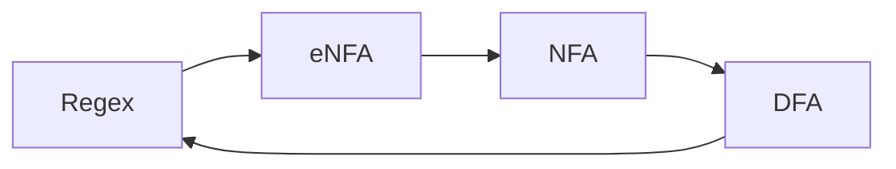

Regular languages such as:

* DFA
* NFA
* $\epsilon$-NFA
* Regular Expressions

are all equally as powerful. They are called regular languages as they can be expressed in regular expressions.

In order to convert from one to the other you can use the following flowchart:



## Examples
Here are some increasingly complex regular expressions and their associated $\epsilon$-NFAs:

1. $R_1=0$:
	
	```mermaid
	stateDiagram-v2
	direction LR
	[*] --> q0 
	q0 --> q1:1
	q1 --> [*]
	```
1. $R_2=01$:
	
	```mermaid
	stateDiagram-v2
	direction LR
	[*] --> q0
	q0 --> q1:0
	q1 --> q2:1
	q2 --> [*]
	```
1. $R_3=0+01$
	
	```mermaid
	stateDiagram-v2
	direction LR
	[*] --> q0
	q0 --> q1:epsilon
	q0 --> q3:epsilon
	q1 --> q2:0
	q3 --> q4:0
	q4 --> q5:1
	q2 --> q6:epsilon
	q5 --> q6:epsilon
	q6 --> [*]
	```
1. $R_4=(0+01)^*$
	
	```mermaid
	stateDiagram-v2
	direction LR
	[*] --> q0
	q0 --> R3:epsilon
	state R3 {
	direction LR
		[*] --> p0
		p0 --> p1:epsilon
		p0 --> p3:epsilon
		p1 --> p2:0
		p3 --> p4:0
		p4 --> p5:1
		p2 --> p6:epsilon
		p5 --> p6:epsilon
		p6 --> [*]
	}
	q0 --> q1:epsilon
	q1 --> q0:epsilon
	R3 --> q1:epsilon
	q1 --> [*]
	```
	This allows for any number of repeats, including an empty word.
	{:.info}

## Formal Definition of a Regular Expression
A **regular expression** over $\Sigma$ is an expression formed using the following rules:

* The symbols $\emptyset$ and $\epsilon$ are regular expressions.
* Every $a$ in $\Sigma$ is a regular expression.
	
	This is every single letter in the alphabet.
	{:.info}
* If $R$ and $S$ are regular expressions so are $R+S, RS$ and $R^*$.

### General Method of Conversion
The following regular expressions are equivalent to their associated $\epsilon$-NFAs:

* $\emptyset$:
	
	```mermaid
	stateDiagram-v2
	direction LR
	[*] --> 
	q0
	```
* $\epsilon$:

	```mermaid
	stateDiagram-v2
	direction LR
	[*] --> q0
	q0 --> [*]
	```
* $a\in\Sigma$:
	
	```mermaid
	stateDiagram-v2
	direction LR
	[*] --> q0
	q0 --> q1:a
	q1 --> [*]
	```
	
	This is for concatenation of symbols.
	{:.info}
* $RS$

	```mermaid
	stateDiagram-v2
	direction LR
	[*] --> q0
	q0 --> R:epsilon
	state R{
		direction LR
		[*] --> [*]
	} 
	R --> S:epsilon
	state S {
		direction LR
		[*] --> [*]
	}
	S --> q1:epsilon
	q1 --> [*]
	```
	
	This is for concatenation of regular expressions.
	{:.info}
* $R+S$:
	
	```mermaid
	stateDiagram-v2
	direction LR
	state R{
		direction LR
		[*] --> [*]
	} 
	state S {
		direction LR
		[*] --> [*]
	}
	[*] --> q0 
	q0 --> R:epsilon
	q0 --> S:epsilon
	R --> q1:epsilon
	S --> q1:epislon
	q1 --> [*]
	```
* $R^*$

	```mermaid
	stateDiagram-v2
	direction LR
	[*] --> q0
	q0 --> R:epsilon
	state R{
		direction LR
		[*] --> [*]
	} 
	q0 --> q1:epsilon
	R --> q1:epsilon
	q1 --> q0:epsilon
	q1 --> [*]
	```