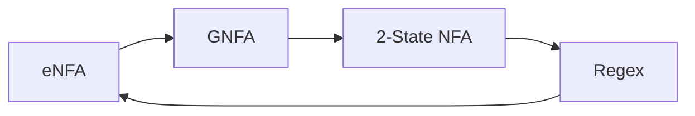
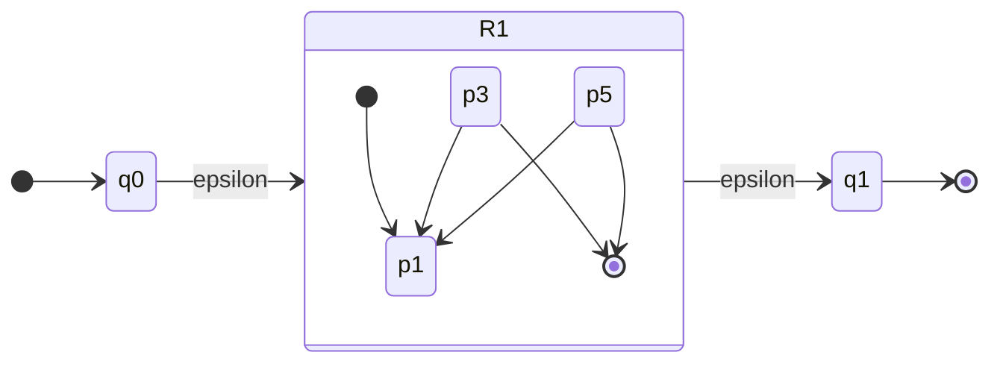
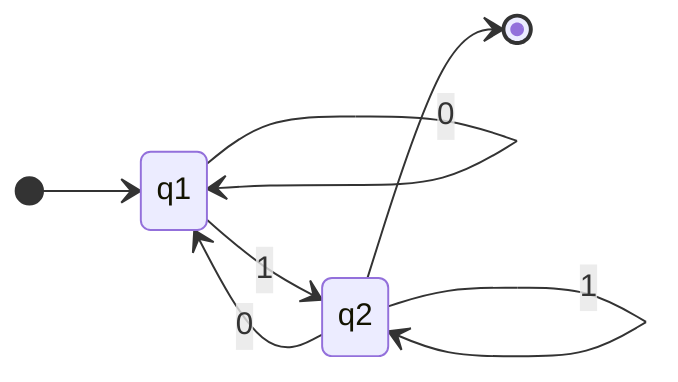
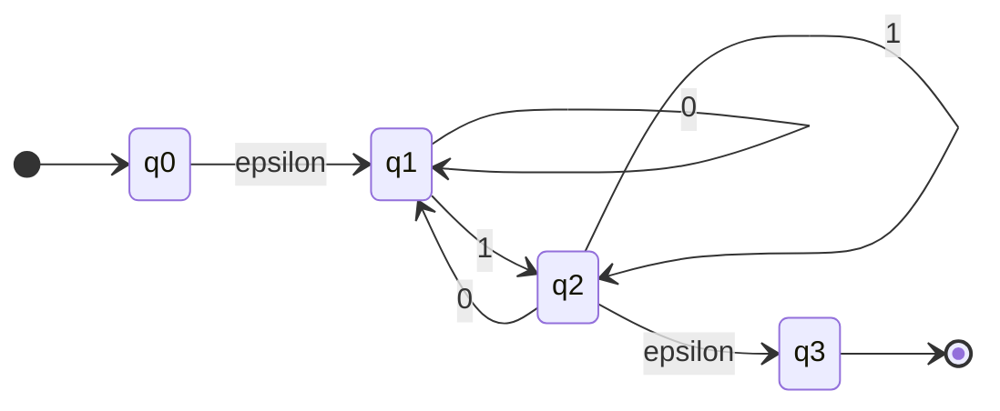
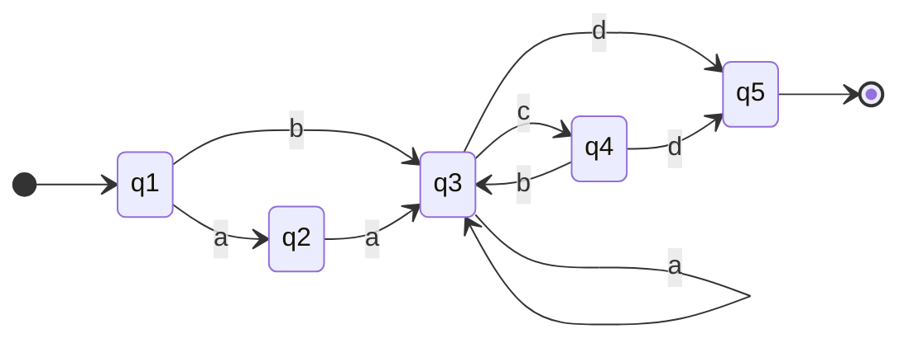

In order to make the translation simpler we take intermediary steps before reaching a regular expression:



A **GNFA** is a generalised non-deterministic finite automata.
{:.info}

## Simplifying $\epsilon$-NFAs
To simplify an $\epsilon$-NFA we must ensure:

* It has only **one** accept state.
* No arrows come **into** the **start** state.
* No arrows go **out of** the **accept** state.

In order to do this we can "wrap" an $\epsilon$-NFA ($R_1$) like so:



### Example 
Simplify the following NFA:



This diagram is not simplified as it has:

* Arrows going into the start state.
* Arrows going out of the accept state

When simplified you get the following diagram:



## Generalised NFAs
A generalised NFA is an $\epsilon$-NFA whose transitions are labelled by **regular expressions**.

### GNFA State Reduction
This is the process of removing every state by the start and accept states. When we are finished we have a two-state GNFA.

1. ```mermaid
	stateDiagram-v2
	direction LR
	[*] --> q0
	q0 --> q1:epsilon + 10*
	q1 --> q1:0*1
	q1 --> q2:0*11
	q2 --> [*]
	q0 --> q2:01
	```

1. ```mermaid
	stateDiagram-v2
	direction LR
	[*] --> q0
	q0 --> q2:(epsilon + 10*)(0*1)*(0*11)
	q2 --> [*]
	q0 --> q2:01
	```

1. ```mermaid
	stateDiagram-v2
	direction LR
	[*] --> q0
	q0 --> q2:((epsilon + 10*)(0*1)*(0*11)) + (01)
	q2 --> [*]
	```

#### General State Elimination Method
To **eliminate** state $q$, for every pair of states $(u,v)$:

* replace:

	```mermaid
	stateDiagram-v2
	direction LR
	u --> q:R1
	q --> q:R2
	q --> v:R3
	u --> v:R4
	```
* with:

	```mermaid
	stateDiagram-v2
	direction LR
	u --> v:R1R2*R3 + R4
	```

Remember to do this even when $u=v$.
{:.info}

#### Conversion Example
Consider the following $\epsilon$-NFA


1. To begin we eliminate $q_1$:
	
	```mermaid
	stateDiagram-v2
	direction LR
	[*] --> q0
	q0 --> q2:0*1
	q2 --> q2:00*1 + 1
	q2 --> q3:epsilon
	q3 --> [*]
	```
	
	Observe how the loop on $q_2$ includes the loop that you could take by going back to $q_1$.
	{:.info}
1. Then eliminate $q_2$:
	
	```mermaid
	stateDiagram-v2
	direction LR
	[*] --> q0
	q0 --> q3:0*1(00*1 + 1)*
	q3 --> [*]
	```
	
The order is important. Always go from start to end.
{:.warning}

For addition examples see the lecture [Examples of $\epsilon$-NFA to Regex Translation](https://liverpool.instructure.com/courses/47455/modules/items/1252620).
{:.info}

#### Complex Example
Consider the following NFA to be converted to regex:



1. First the NFA needs to be simplified. This isn't required as it satisfies [all the conditions]({{site.baseurl}}/comp218/lectures/2021/10/16/1.html#simplifying-epsilon-nfas).
1. Eliminate up to $q_2$ (this has no effect as there are no loops on $q_2$ or before):

	```mermaid
	stateDiagram-v2
	direction LR
	[*] --> q1
	q1 --> q2:a
	q1 --> q3:b
	q2 --> q3:a
	q3 --> q3:a
	q3 --> q4:c
	q3 --> q5:d
	q4 --> q3:b
	q4 --> q5:d
	q5 --> [*]
	```
1. Eliminate up to $q_3$:

	```mermaid
	stateDiagram-v2
	direction LR
	[*] --> q1
	q1 --> q3:aa + b
	q3 --> q3:(a + cb)* 
	q3 --> q4:c
	q3 --> q5:d
	q4 --> q5:d
	q5 --> [*]
	```
	Ensure to eliminate loops connecting to $q_3$ as noted in the [general state elimination method]({{site.baseurl}}/comp218/lectures/2021/10/16/1.html#general-state-elimination-method).
	{:.info}
1. Eliminate up to $q_4$:

	```mermaid
	stateDiagram-v2
	direction LR
	[*] --> q1
	q1 --> q4:(aa + b)(a + cb)*c
	q1 --> q5:d
	q4 --> q5:d
	q5 --> [*]
	```
1. Eliminate $q_5$ leaving the final regex:

	```mermaid
	stateDiagram-v2
	direction LR
	[*] --> q1
	q1 --> q5:(aa + b)(a + cb)*(cd + d)
	q5 --> [*]
	```