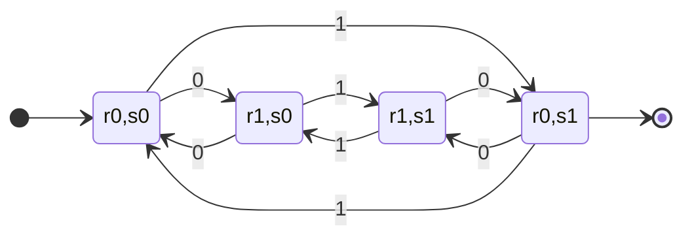
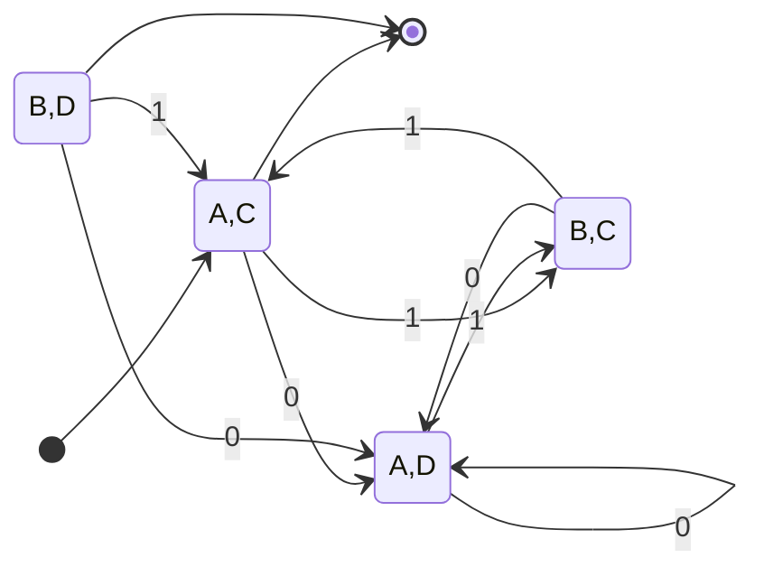
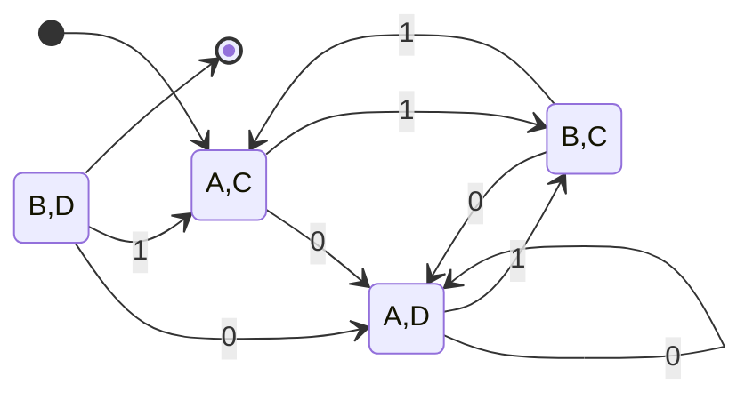

## Language Classes
A language class is a set of languages. So far we have seen one language class which is the **regular languages**. 

Language classes have two important properties:

* Decision Properties
* Closure Properties.

### Decision Properties
A **decision property** for a class of languages is an algorithm that takes a formal description of a language (such as a DFA) and tells whether or not some property holds.

You could have several properties:

* Is the language empty?
* Are all the words in the language finite?
* Do all the words end with a given letter?

#### Decision Property Example
We can use a DFA to represent the behaviour of a communication protocol. We can check whether the communication is valid by examining the language of the DFA.

We can examine the following properties:

* Can the protocol succeed?
	* Is the language non-empty?
* Does it always end with an acknowledgement signal?
	* Do all words end with "ACK"?

### Closure Properties?
A **closure property** of a language class says that given language in the class, an operator (such as union) produces another language in the same class.

* Closure properties give us a better understanding of a given language class and its limitations.
* They also allow use to know that a language is in a given class even if we don't know how to represent it in the language.

## Union
To prove closure under union we need to prove that you can make a union in a regular language. So therefore we want to prove:

If $L$ and $M$ are regular languages, so is $L\cup M$.

**Proof:** Let $L$ and $M$ be the language of regular expressions $R$ and $S$, respectively.

Then $R+S$ is a regular expression whose language is $L\cup M$.  
$\blacksquare$

## Complement
The **complement** $\bar L$ of a language $L$ contains those strings that are not in $L$.

For example ($\Sigma=\\{0,1\\}$):

* $L_1 =$ all strings that end in $101$
* $\bar L_1=$ all string that do not end in $101$:
	* All strings that end in $000,\ldots,111$ or have length $0,1$.
	
Both of these are part of the language class of regular languages but the second is much more complicated.
{:.info}

### Closure Under Complement
If $L$ is a regular language, so is $\bar L$.

To argue this we can use any definition of regular language (NFA, DFA, regex).
{:.info}

For any DFA, a DFA with the accept and reject states swapped is it's complement.

**Proof**: For every input $x\in\Sigma^*$:

1. $M$ accepts $x$.
1. After processing $x,M$ end in an accepting state.
1. After processing $x,m'$ ends in a rejecting state.
1. $M'$ rejects $x$.

All of these statements are equivalent for DFAs.
{:.info}

Therefore the language of $M'$ is $\bar L$ meaning that $\bar L$ is regular.  
$\blacksquare$

This is not true for NFAs.
{:.warning}

## Intersection
The intersection $L\cap L'$ is the set of strings that are both in $L$ and $L'$.

### Closure Under Intersection
If $L$ and $L'$ are regular languages, so is $L\cap L'$.

To argue this we can use DFAs
{:.info}

Consider that we have the following DFAs ($M$ and $M'$):

* * $L=$ even number of 0s:

	```mermaid
	stateDiagram-v2
	state M{
	direction LR
	[*] --> s0
	s0 --> s0:1
	s0 --> s1:0
	s1 --> s0:0
	s1 --> s1:1
	s0 --> [*]
	}
	```
	
* $L'=$ odd number of 1s:

	```mermaid
	stateDiagram-v2
	direction LR
	state M'{
	direction LR
	[*] --> s0
	s0 --> s0:0
	s0 --> s1:1
	s1 --> s0:1
	s1 --> s1:0
	s1 --> [*]
	}
	```

We can combine the above diagrams like so:



This is the **product construction** as it simulates the behaviour of both at the same time. The product of a DFA has the **Cartesian product** of the sates of the parent diagrams.
{:.info}

Accepting states have to be accepting in **both** parent graphs.
{:.info}

## Reversal
The **reversal** $w^R$ of a string is $w$ written backwards:

* $w=\text{dog}$
* $w^R=\text{god}$

The reversal $L^R$ of a language $L$ is the language obtinaed by reversing all its strings:

* $L=\\{\text{cat, dog}\\}$
* $L^R=\\{\text{tac, god}\\}$

### Proof of Closure Under Reversal
We can use regular expressions to prove this closure. We can define a regular expression as having the following types:

* The special symbols $\emptyset$ and $\epsilon$.
* Alphabet symbols like $a,b$.
* The **union**, **concatenation** or **star** of simpler expressions.

| Regular Expression $E$ | Reversal $E^R$ |
| :-- | :-- |
| $\emptyset$ | $\emptyset$ |
| $\epsilon$ |  $\epsilon$ |
| $a$ (alphabet symbol) | $a$ |
| $E_1+E_2$ | $E_1^R+E_2^R$ |
| $E_1E_2$ | $E_2^RE_1^R$ |
| $E_1^*$ | $(E_1^R)^*$ |

## The Emptiness Problem
There are some languages that can't be represented in the regular language class. One example is the language of duplicates:

$$
L^\text{DUP}=\{ww:w\in L\}
$$

* $L=\\{\text{cat, dog}\\}$
* $L^\text{DUP}=\\{\text{catcat, dogdog}\\}$

If you try to make an NFA for this language then it would be infinitely long.

You aren't able to compute the full set of reachable states.
{:.info}

Here are the requirements for them emptiness problem:

1. Given a regular language, does the language contain any string at all?
1. Assuming the representation is a DFA construct a transition graph.
	* Compute the set of states reachable from the start state.
1. If any final state is reachable, then yes; else no.

## Equivalence
Given regular languages $L$ and $M$, is $L=M$?

This algorithm involves constructing the **product DFA**, like above.
{:.info}

Consider that we want to find if the following DFAs are the same:

1. ```mermaid
	stateDiagram-v2
	state L {
	direction LR
	[*] --> A
	A --> A:0
	A --> B:1
	B --> A:0,1
	B --> [*]
	}
	```
	
1. ```mermaid
	stateDiagram-v2
	state M {
	direction LR
	[*] --> C
	C --> C:1
	C --> D:0
	D --> D:0
	D --> C:1
	C --> [*]
	}
	```
	
We can combine the above diagrams like so:



The accept states are those which are accepted only in $L$ **or** $M$ but **not both**.
{:.info}

The product DFA's language will be empty if $L=M$. If any accept states are reachable then the languages are different.
{:.info}

## Containment
Given regular languages $L$ and $M$ is $L\subseteq M$?

This algorithm also uses the **product automaton**, like above.
{:.info}

Consider that we want to find if $L$ is a subset of $M$:

1. ```mermaid
	stateDiagram-v2
	state L {
	direction LR
	[*] --> A
	A --> A:0
	A --> B:1
	B --> A:0,1
	B --> [*]
	}
	```
	
1. ```mermaid
	stateDiagram-v2
	state M {
	direction LR
	[*] --> C
	C --> C:1
	C --> D:0
	D --> D:0
	D --> C:1
	C --> [*]
	}
	```
	
We can combine the above diagrams like so:



A state is accepting if it is accepting in $M$ **and not** $L$.
{:.info}

If the final state is unreachable then the containment holds.
{:.info}

