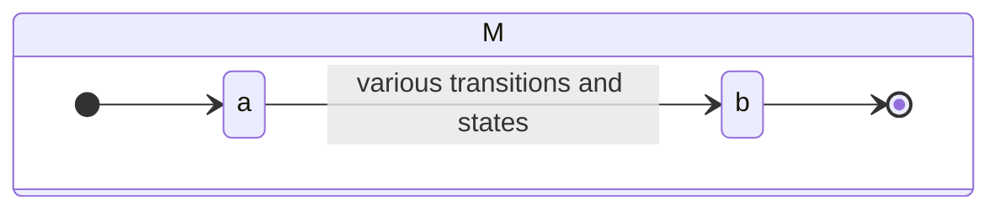
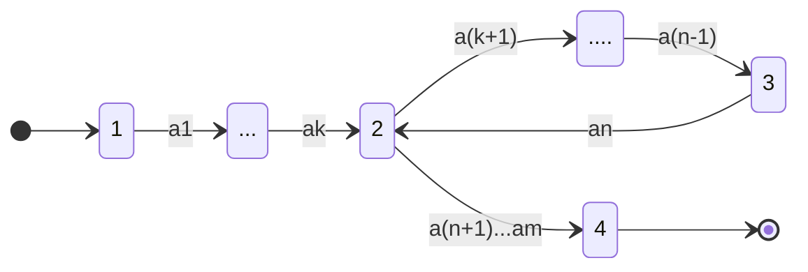
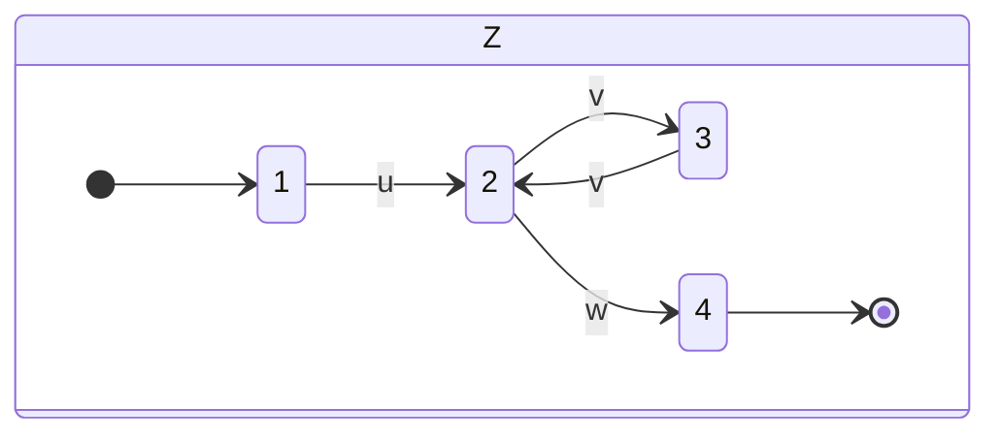

## Non-Regular Language Example
Consider the following language:

$$
L_0=\{0^n1^n\vert n\geq0\}
$$

This is the language of any number of zeros followed by an equal number of ones.
{:.info}

To show that this is non-regular we reason by **contradiction**:

* Suppose we manage to construct a DFA $M$ for $L_0$ with $n$ states.
* We argue that something must be wrong with this DFA.
* In partucular $M$ must accept some strings outside $L_0$.

Consider we have this imaginary automaton:

when we run it on the string $x$ where:

$$
x = 0^{n+1}1^{n+1}
$$

it should accept as $x\in L_0$:

* Since $M$ has $n$ states it must revisit some state in order to be finite when reading our infinite string.
	
	This is the pigeon hole principle as a DFA with $n$ states reading $n+1$ letters must revisit the same state twice.
	{:.info}
* This results in a loop which would be invalid as you could read as many ones as you want without reading the same number of ones.

## General Method for Showing Non-Regularity
Every language $L$ has the following property:

For every sufficiently long input $z$ in $L$, there is a *middle part* in $z$ that, even if repeated any number of times, keeps the input inside $L$.
{:.info}

### Pumping Lemma
Every regular language $L$ has the property of **pumping lemma**:

* There exists a number $n$ such that for all strings $z$ in $L$ longer than $n$, we can write $z=uvw$ where:
	1. $\vert uv\vert\leq n$
	1. $\vert v\vert\geq 1$
	1. For all $i\geq0$, the string $uv^iw$ is in $L$.
	

### Arguing Non-Regularity
If $L$ is regular then:

* There exists $n$ such that for all $z$ in $L$ longer than $n$, we can write $z=uvw$ where:
	1. $\vert uv\vert\leq n$
	1. $\vert v\vert\geq 1$
	1. For all $i\geq0$, the string $uv^iw$ is in $L$.
	
	We are proving that the pumping lemma holds as all regular languages have this property.
	{:.info}
	
So to prove $L$ is **not** regular it is enough to show:

* For all $n$ there exists $z$ longer than $n$, such that for all ways of writing $z=uvw$ where:
	1. $\vert uv\vert\leq n$
	1. $\vert v\vert\geq 1$
	1. For all $i\geq0$, the string $uv^iw$ is **not** in $L$.
	
	This is showing that the opposite is true.
	{:.info}