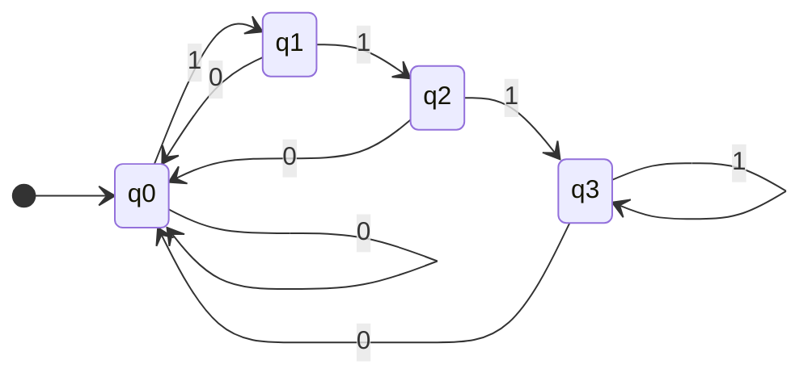
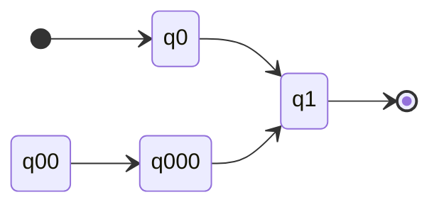
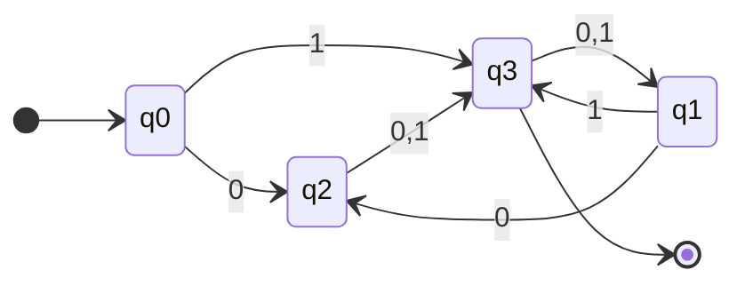
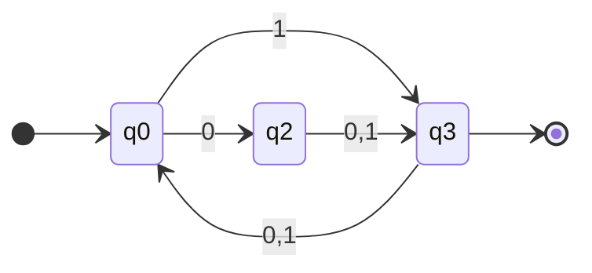

## Proving Minimalism
Consider the following minimal DFA for the language $L=\{w:w\text{ ends in }111\}$:

Is it possible to do this in three states (one less)? 

1. The minimum string for this language is $111$. There are four inputs to get to this string:

	* $\epsilon$
	* $1$
	* $11$
	* $111$

	As there are four inputs and we want to reduce to three states, two inputs must end up in the same state (pigeon hole principle).
1. Suppose $x=1,y=11$ lead to the **same state**.
	
	* Then after reading **one more** 1:
		* The state of $x1=11$ should be **rejecting**.
		* The state of $y1=111$ should be **accepting**.
	
	This is a contradiction so these two states can't be reduced together.
	{:.error}
1. Suppose $x=\epsilon,y=1$ lead to the **same state**.
	
	* Then after reading 11:
		* The state of $x11=11$ should be **rejecting**.
		* The state of $y11=111$ should be **accepting**.
	
	This is a contradiction so these two states can't be reduced together.
	{:.error}
1. All other pairs should be tested. If all pairs can be brought to a contradiction, from any input, then the DFA is **minimal**.

## DFA Minimisation
Minimal DFAs have the following properties:

* Every pair of states is **distinguishable**.
* Every state is **accessible**.

### Accessible States
Strings of states that don't have an entry transition aren't accessible.

In this example $q_{00}$ and $q_{000}$ aren't accessible, so can be removed.
{:.info}

### Distinguishable States
Two states $q$ and $q'$ are **distinguishable** if on the same **continuation string** $w_1w_2\ldots w_k$, one accepts but the other rejects.

#### Example
Consider the following state diagram:

| Pair of States | Exit Transitions in Common |
| :-- | :-- |
| $(q_0,q_3)$ | Distinguishable by $\epsilon$ |
| $(q_1,q_3)$ | Distinguishable by $\epsilon$ |
| $(q_2,q_3)$ | Distinguishable by $\epsilon$ |
| $(q_1,q_2)$ | Distinguishable by $0$ |
| $(q_0,q_2)$ | Distinguishable by $0$ |
| $(q_0,q_1)$ | Indistinguishable |

Indistinguishable pairs can then be merged:

