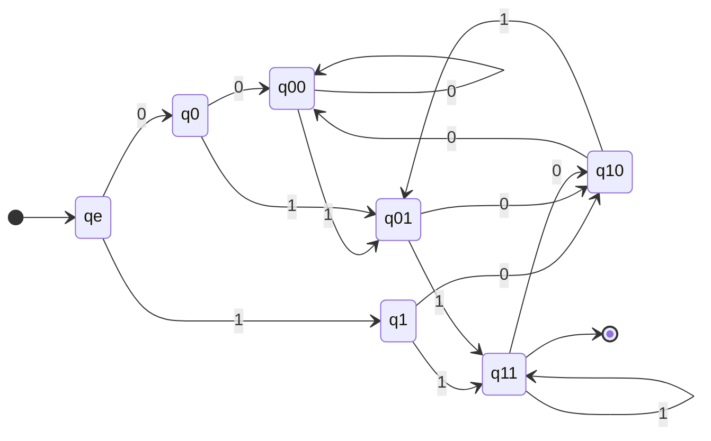
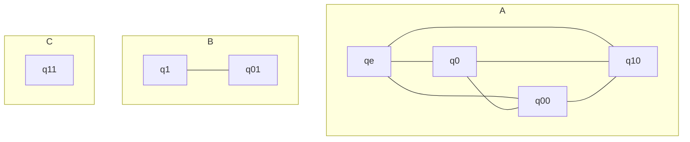
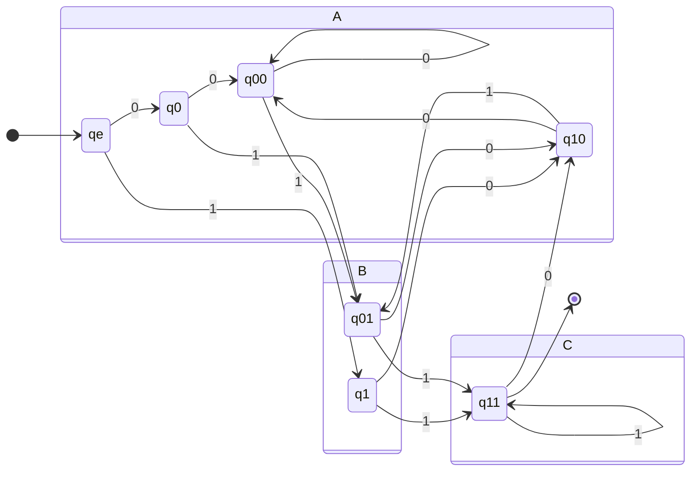
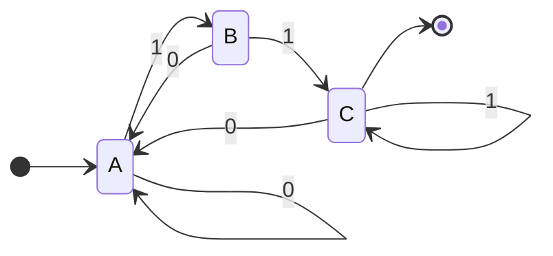

## Finding Indistinguishable States

1. If $q$ is accepting and $q'$ is rejecting, mark $(q,q')$ as distinguishable:

	```mermaid
	stateDiagram-v2
	direction LR
	[*] --> q(x)
	q'(x) --> [*]
	```
1. If $(q_1,q_1;)$ are marked, mark $(q_2,q_2')$ as distinguishable:

	```mermaid 
	stateDiagram-v2
	direction LR
	q2(x) --> q1(x):a
	q2'(x) --> q1'(x):a
	```
1. Unmarked pairs are indistinguishable, merge them into **groups**.

### Example of DFA Minimisation
Consider the following DFA to be minimised:



This would produce the following table:

| | $q_\epsilon$ | $q_0$ | $q_1$ | $q_{00}$ | $q_{01}$ | $q_{10}$ |
| :-: | :-: | :-: | :-: | :-: | :-: | :-: |
| $q_0$ | | 
| $q_1$ | × | × |
| $q_{00}$ | | | × |
| $q_{01}$ | × | × | | × |
| $q_{10}$ | | | × | | ×
| $q_{11}$ | × | × | × | × | × | × | × |

The top-right diagonal is unused.
{:.warning}

1. To begin mark all accept states ($q_{11}$) as distinguishable.
1. Go through each state pair and mark it as distinguishable if is **transitions** to a distinguishable state pair.
	
	For **each** state in the pair, transition via 0. The **two states** which each state transitions to are result of the state pair transition via 0. Repeat this for 1 to find the other state pair.
	{:.info}
	
1. Repeat (2.) for all states until there is no change.
1. Apply rule 3 and remove indistinguishable states from the state graph.

#### Grouping Unmarked states
We can group unmarked states by drawing lines between each unmarked pair:



Each group becomes a state. Analyse the transitions between states in order to determine the transitions between groups:



Remember to include self loops.
{:.info}

This gives the following minimal state diagram:



We know it is minimal as all the states are distinguishable.
{:.info}