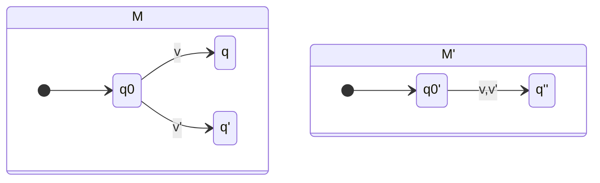
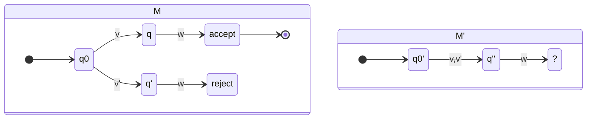

## Why Are *All* Distinguishable Pairs Found?
This is because we work backwards from the accept states. 

There are $n^2$ pairs of states for each DFA where $n$ is the number of states. Therefore, the number of pairs of states to be searched is finite.

## Why Are There No *Inconsistencies* When We Merge?
This is the scenario that the **same** transition goes to **multiple** state groups.

This is not an issue as we only merge **indistinguishable** states.

## Why is There no Smaller DFA.
If there were a smaller DFA you would be able to merge two states and transitions like so:

However, as every pair of states is distinguishable (goes to an accept or a reject state), the above cannot happen:

$M'$ cannot exist using this method.
{:.error}

### Formal Proof
> **Theorem**: If a DFA has no inaccessible states, and no indistinguishable states, then it has a minimal number of states.

**Proof**: Suppose $M$ has $n$ states that are accessible and distinguishable.

Suppose $M'$ is equivalent to $M$ but only $n-1$ states. We can find $n$ words that reach each of the $n$ states of $M$ (*use accessibility*).

Two of these words must reach the same states of $M'$.

We can find a suffix for these two words such that $M$ would accept one but not the other (*use distinguishability*).

But both words, with any suffix attached, must reach the same state in $M'$. So $M'$ cannot accept the same set of words. $\blacksquare$