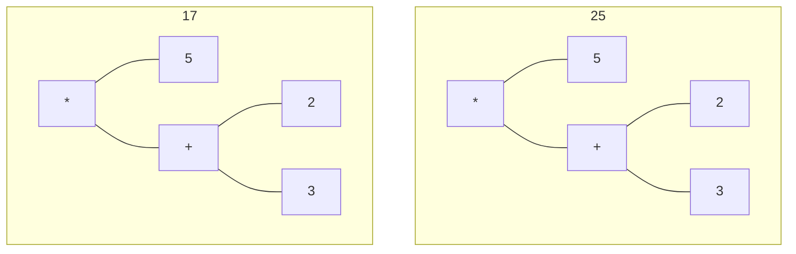
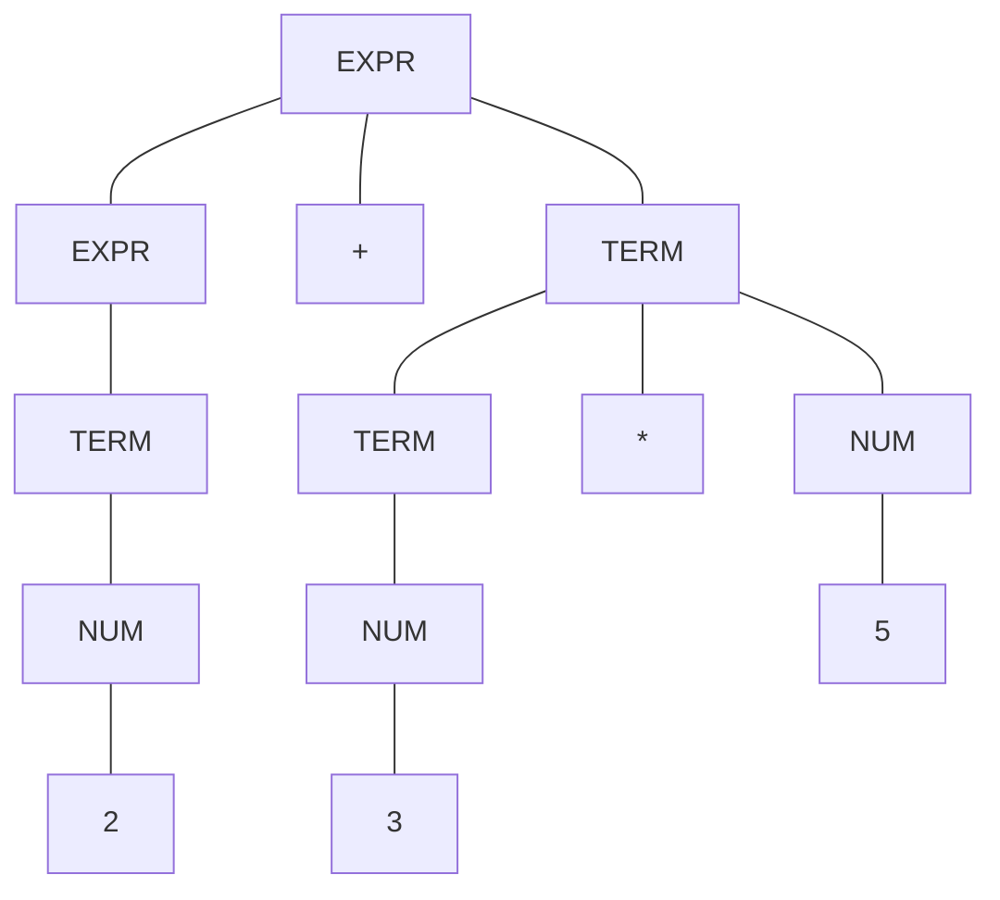

## Precedence in Arithmetic Expressions
Consider we run the following in the python shell:

```python
>>> 2 + 3 * 5
17
```

This could be represented as the following trees:



We know that the `17` tree has the correct **precedence**.
{:.info}

## Grammars
Consider that we have the following rules for a grammar:

```
EXPR -> EXPR + TERM
EXPR -> TERM
TERM -> TERM + TERM
TERM -> NUM
NUM -> 0-9
```

We can parse the same `2 + 3 * 5` as before like so:



By applying the rules we always get the correct precedence. 
{:.info}

### Simplistic English Grammar
Consider that we can use the following rules in English:

```
SENTENCE -> NOUN-PHRASE VERB-PHRASE
NOUN-PHRASE -> A-NOUN
NOUN-PHRASE -> A-NOUN PREP-PHRASE
PREP-PHRASE -> PREP NOUN-PHRASE
```

With these rules we can make a sentence like the one below:

$$
\underbrace{\underbrace{\text{a girl }}_\text{A-NOUN}\underbrace{\underbrace{\text{with }}_\text{PREP}\underbrace{\text{a flower}}_\text{NOUN-PHRASE}}_\text{PREP-PHRASE}}_\text{SENTENCE}
$$

You can go further to define all parts of a language in order to make a grammar.
{:.info}