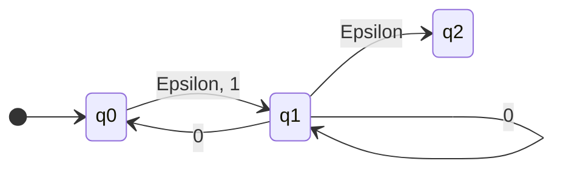
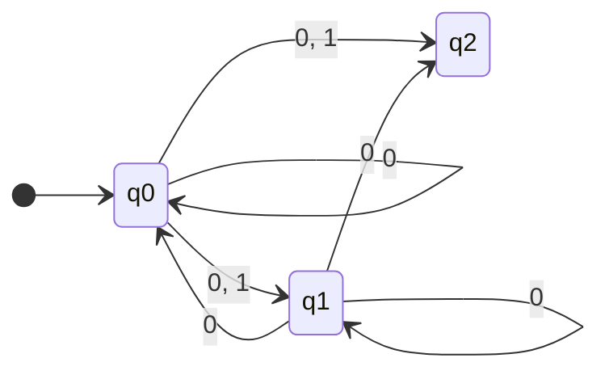
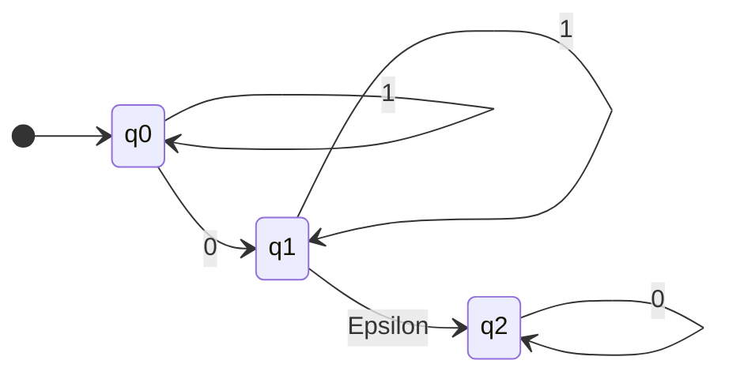

In this lecture we will be doing step 1 from the previous lecture [NFA to DFA Conversion (Determinisation)]({{site.baseurl}}/comp218/lectures/2021/10/04/1.html).

## Eliminating $\epsilon$-Transitions
Consider the following $\epsilon$-NFA:



To convert this to an NFA we can keep track of the accessible states in a table:

| | 0 | 1 |
| :-: | :-: | :-: |
| $q_0$ | $\\{q_0,q_1,q_2\\}$ | $\\{q_1,q_2 \\}$ | 
| $q_1$ | $\\{q_0,q_1,q_2\\}$ | $\emptyset$ |
| $q_2$ | $\emptyset$ | $\emptyset$ |

To calculate the **accept states**, we first include all prior accept states and then all states which can get to the accept state via $\epsilon$-transitions. For this diagram that includes all states:

$$\\{q_0, q_1, q_2\\}$$

We can then put this into a diagram:



### Elimination Rules
* Paths with several $\epsilon$s are replaced by a single transition:

	```mermaid
	flowchart
	subgraph eNFA
	1 -->|Epsilon| 2
	2 -->|a| 3
	3 -->|Epsilon| 4
	4 -->|Epsilon| 5
	end
	eNFA --> NFA
	subgraph NFA
	12[1] -->|a| 15[5]
	end
	```

	```mermaid
	flowchart
	subgraph eNFA
	3 -->|Epsilon| 4
	4 -->|a| 5
	5 -->|Epsilon| 3
	end
	eNFA --> NFA
	subgraph NFA
	13[3] -->|a| 13
	end
	```

* States that can reach final state by $\epsilon$ are all accepting.

## $\epsilon$-Closure
This is part of the formal definition of the elimination rules above.

$$\text{CL}(A)=\\{q\in Q:q\text{ can be reached from some state in } A \text{ using only } \epsilon\text{-transitions}\\}$$

Note that always $A\subseteq \text{CL}(A)$ and $\text{CL}(Q)=Q$.
{:.info}

Therefore, for the following $\epsilon$-NFA:


* $\text{CL}(\\{q_0\\})=\\{q_0,q_1,q_2\\}$
* $\text{CL}(\\{q_0\\})=\\{q_1,q_2\\}$
* $\text{CL}(\\{q_0\\})=\\{q_2\\}$
* $\text{CL}(\\{q_0,q_1\\})=\\{q_0,q_1,q_2\\}$
* $\text{CL}(\\{q_0,q_1,q_2\\})=\\{q_0,q_1,q_2\\}$
* $\text{CL}(\emptyset)=\emptyset$

## Formal Definition
Remembering that:

$$\text{CL}(A)=\\{q\in Q:q\text{ can be reached from some state in } A \text{ using 0 or more } \epsilon\text{-transitions}\\}$$

| | $\epsilon$-NFA | NFA |
| :-- | :-- | :-- |
| States | $q_0,q_1,\ldots,q_n$ | $q_0,q_1,\ldots,q_n$ |
| Initial State | $q_0$ | $q_0$ |
| Transitions | $\delta$ | $\delta'(q,a)=\text{CL}(\delta(\text{CL}(\\{q\\}),a))=$ $\text{CL}(\cup_{q'\in\text{CL}(\\{q\\})}\delta(q',a))$ |
| Accepting States | $F\subseteq Q$ | $F'=\\{q:\text{CL}(\\{q\\})\cap F\neq\emptyset\\}$ |

### Formal Example (With $\epsilon$-Closures)
For the following example:



* $\text{CL}(\\{q_0\\})=\\{q_0\\}$
* $\text{CL}(\\{q_1\\})=\\{q_1, q_2\\}$
* $\text{CL}(\\{q_2\\})=\\{q_2\\}$

	This is how far you can get in zero hops from any state.
	{:.info}
	
* $\text{CL}(\delta(\text{CL}(\\{q_0\\}),0))=\text{CL}(\delta(q_0,0))=\text{CL}(\\{q_1\\})=\\{q_1,q_2\\}$
* $\text{CL}(\delta(\text{CL}(\\{q_1\\}),0))=\text{CL}(\delta(\\{q_1,q_2\\},0))=\text{CL}(\\{q_2\\})=\\{q_2\\}$
* $\text{CL}(\delta(\text{CL}(\\{q_2\\}),0))=\text{CL}(\delta(q_2,0))=\text{CL}(\\{q_2\\})=\\{q_2\\}$


	This is how far you can get by reading a 0.
	{:.info}

* $\text{CL}(\delta(\text{CL}(\\{q_0\\}),1))=\text{CL}(\delta(q_0,1))=\text{CL}(\\{q_0\\})=\\{q_0\\}$
* $\text{CL}(\delta(\text{CL}(\\{q_1\\}),1))=\text{CL}(\delta(\\{q_1,q_2\\},1))=\text{CL}(\\{q_1\\})=\\{q_1,q_2\\}$
* $\text{CL}(\delta(\text{CL}(\\{q_2\\}),1))=\text{CL}(\delta(q_2,1))=\text{CL}(\emptyset)=\emptyset$


	This is how far you can get by reading a 1.
	{:.info}
	
To calculate the accepting states we look at all the states which have existing accepting states in their closure. For this example they are:

* $\text{CL}(\\{q_1\\})=\\{q_1, \bf q_2\\}$
* $\text{CL}(\\{q_2\\})=\\{\bf q_2\\}$
