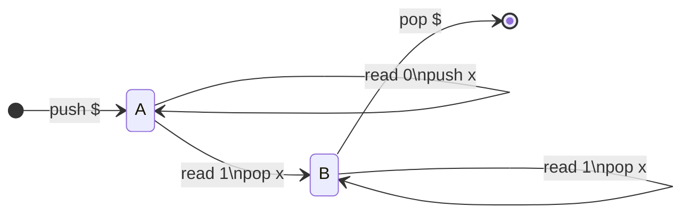
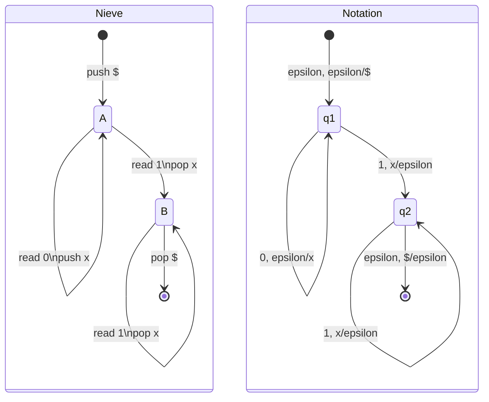

For additional examples of PDAs see [this lecture video](https://liverpool.instructure.com/courses/47455/modules/items/1252581).
{:.info}

Pushdown automata are a computation version (like NFA/DFA) of context free grammars. They are **equivalent** to CFGs.

Pushdown automata are similar to NFAs but they have an **infinite stack**:

* As the PDA is reading the input, it can **push/pop** symbols from **the top of** the stack.

## Building a PDA
We can build a PDA for the following context free grammar:

$$
L=\{0^n1^n:n\geq1\}
$$

* We remember each 0 by **pushing** $x$ onto the stack.
* When we see a 1, we **pop** an $x$ from the stack.
* We want to accept when we hit the **stack bottom**.

We use \$ to mark the bottom of the stack.
{:.info}

### Notation for PDAs
The prior PDA didn't use the correct notation. Below is the example from before, and a PDA with correct notation:

This notation is in the form `read, pop/push`
{:.info}

## Definition of a PDA
A pushdown automaton is ($Q,\Sigma,\Gamma, \delta, q_0,F$) where:

* $Q$ is a finite set of **states**.
* $\Sigma$ is the **input alphabet**.
* $\Gamma$ is the **stack alphabet**.
* $q_0$ in $Q$ is the **initial state**.
* $F\subseteq Q$ is a set of **final states**.
* $\delta$ is the **transition function**.

$$
\delta:\underbrace{Q}_\text{state}\times\underbrace{(\Sigma\cup\{\epsilon\})}_\text{input symbol}\times\underbrace{(\Gamma\cup\{\epsilon\})}_\text{pop symbol}\rightarrow\text{subsets of }\underbrace{Q}_\text{state}\times\underbrace{(\Gamma\cup\{\epsilon\})}_\text{push symbol}
$$

## The Language of a PDA
> The **language** of a PDA is the set of all strings in $\Sigma^*$ that **can lead** the PDA to an accepting state after the whole input is read.

* A PDA is nondeterministic.
	* Multiple transitions on the same pop/input are allowed.
* Transitions **may** but **do not have to** push, pop or read input.

Sometimes acceptance is defined by emptying the stack or even an empty stack and accepting state. All these variants correspond to the same class of languages.
{:.info}