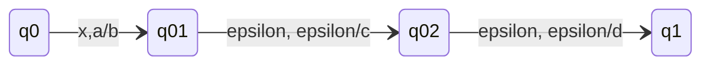
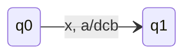
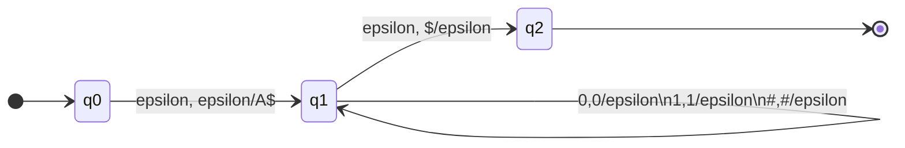
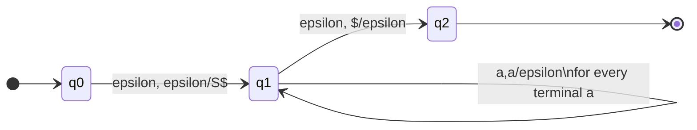

## Pushdown Automata Convention
When we have a **sequence of transitions** like:

Pop $a$ then push $b$, $c$ and $d$.
{:.info}

We will abbreviate it like this:

Replace $a$ by $dcb$ on top of the stack (notice: the reverse order: the first symbol of the word is at the top of the stack)
{:.info}

## Converting a CFG to a PDA
The idea is to simulate the derivations.
{:.info}

We will convert the following context free grammar:

$$
\begin{aligned}
A&\rightarrow 0A1\\
A&\rightarrow B\\
B&\rightarrow \#
\end{aligned}
$$

This would produce the following PDA:

* The **first** transition is the **main** production. 
* The **middle** is all **productions** and **terminals**.
* The **end** is the **empty stack**.

We can then use this to match a given input string (`00#11`):

| Stack | Input Processed |
| :-- | :-- |
| $A | |
| $1A0 | |
| $1A | 0 |
| $11A0 | 0 |
| $11A | 00 |
| $11B | 00 |
| $11# | 00 |
| $11 | 00# |
| $1 | 00#1 |
| $ | 00#11 |

As only the empty stack remains, then the input is valid.
{:.info}

### General CFG to PDA Conversion

