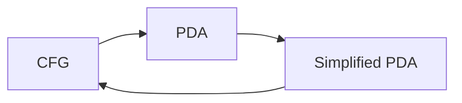
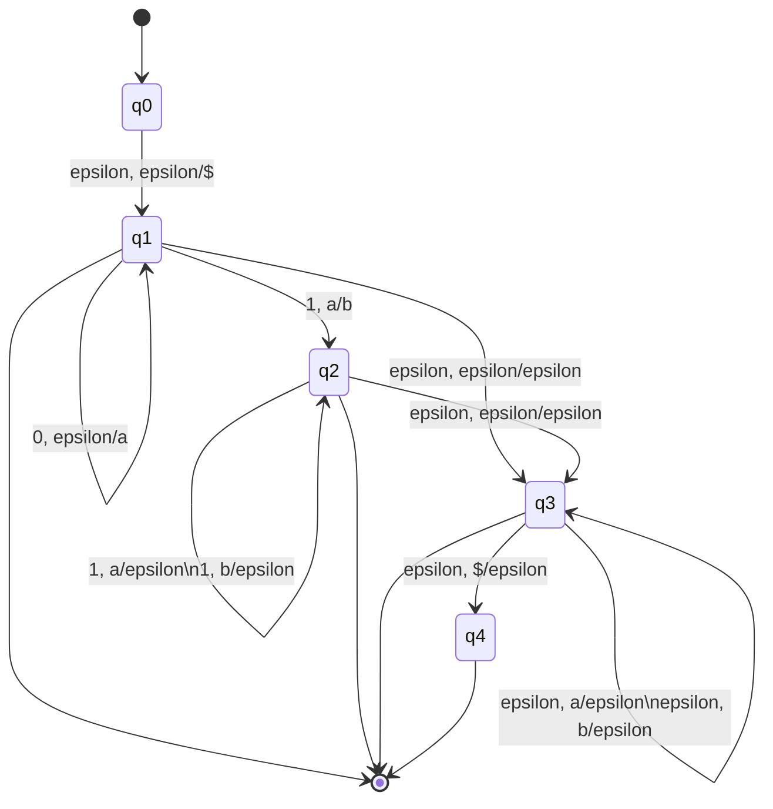

## Simplified PDA
To convert a PDA to CFG you first have to convert to a **simplified PDA**:



To be simplified it must have the following properties:

* Has a single accept state.
* Empties it's stack before accepting.
* Each transaction is either a push, or a pop, but not both.

Consider the following PDA:



1. Single accept state:

	```mermaid
	stateDiagram
	[*] --> q0
	q0 --> q1:epsilon, epsilon/$
	q1 --> q1: 0, epsilon/a
	q1 --> q2: 1, a/b
	q2 --> q2: 1, a/epsilon\n1, b/epsilon
	q1 --> q3: epsilon, epsilon/epsilon
	q2 --> q3: epsilon, epsilon/epsilon
	q3 --> q3: epsilon, a/epsilon\nepsilon, b/epsilon
	q3 --> q4: epsilon, $/epsilon
	q4 --> [*]
	```
1. Empty stack before accepting:

	This is already the case so no change is needed.
1. Each transition is a push, pop, but not both:

	```mermaid
	stateDiagram
	[*] --> q0
	q0 --> q1:epsilon, epsilon/$
	q1 --> q1: 0, epsilon/a
	q1 --> q5: 1, a/epsilon
	q5 --> q2: 1, epsilon/b
	q2 --> q2: 1, a/epsilon\n1, b/epsilon
	q1 --> q6: epsilon, epsilon/x
	q6 --> q3: epsilon, x/epsilon
	q2 --> q7: epsilon, epsilon/x
	q7 --> q3: epsilon, x/epsilon
	q3 --> q3: epsilon, a/epsilon\nepsilon, b/epsilon
	q3 --> q4: epsilon, $/epsilon
	q4 --> [*]
	```

## Simplified PDA to CFG
Consider the following run of the PDA on the input `00011`:

| Input | State | Stack | | | |
| :-- | :-- | :-- | :-- | :-- | :-- |
| | $q_0$ | | | | |
| $\epsilon$ | $q_1$ | $ | | | |
| $0$ | $q_1$ | $ | a | | |
| $0$ | $q_1$ | $ | a | a | |
| $0$ | $q_1$ | $ | a | a | a |
| $1$ | $q_5$ | $ | a | a | |
| $\epsilon$ | $q_2$ | $ | a | a | b |
| $1$ | $q_2$ | $ | a | a | |
| $\epsilon$ | $q_7$ | $ | a | a | x |
| $\epsilon$ | $q_3$ | $ | a | a | |
| $\epsilon$ | $q_3$ | $ | a | | |
| $\epsilon$ | $q_3$ | $ | | | |
| $\epsilon$ | $q_4$ | | | | |

1. We can view each column of the same character in the stack as a production:

	* For the first column of `a` we can have the following production:

		$$
		A_{13}=\{x,x\text{ leads from } q_1 \text{ to } q_3\text{ and does not dip under the red line}\}
		$$
		
		The *red line* here is the first column of `a`.
		{:.info}
		
		This is called $A_{13}$ as it takes us from $q_1$ to $q_3$. This is taken from the row **before the column** up to **the row of** the last entry in the column.
		{:.info}
1. From this we can consider the inputs that surround the column in order to complete the production:

	$$
	A_{13}\rightarrow 0A_{13}\epsilon
	$$
	
	These are taken **from the row** where the column starts and **the row after** the column ends.
	{:.info}

There are additional, simpler, examples available in the [lecture video](https://liverpool.instructure.com/courses/47455/modules/items/1252565).
{:.info}

### General Method
The CFG will be made of two type of productions:

* Variables ($A_{ij}$) - Go from $q_i$ to $q_j$.
* Start Variable ($A_{0f}$) - Go from the single start state $q_0$ to the single accept state $q_f$.

We can then simplify the following components:

1. $A_{ij} \rightarrow aA_{i_1j_1}b$

	```mermaid
	stateDiagram
	direction LR
	state intermediate {
	direction LR
	[*] --> [*]
	}
	qi --> qi1:a, epsilon/x
	qi1 --> intermediate
	intermediate --> qj1
	qj1 --> qj:b, x/epsilon
	```
1. $A_{ik}\rightarrow A_{ij}A_{jk}$

	```mermaid
	stateDiagram
	direction LR
	state intermediate1 {
	direction LR
	[*] --> [*]
	}
	state intermediate2 {
	direction LR
	[*] --> [*]
	}
	qi --> intermediate1
	intermediate1 --> qj
	qj --> intermediate2
	intermediate2 --> qk
	```
1. $A_{ii}\rightarrow\epsilon$
	
	```mermaid
	stateDiagram
	qi
	```